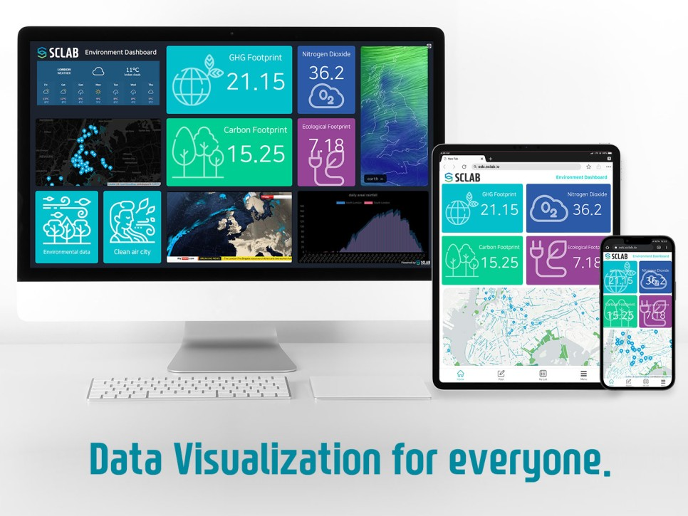

The need for more skilled developers is becoming a growing problem in the IT industry. One of the main reasons for this problem is the rapid expansion of the technology sector and the ever-increasing need for software development across industries. Recent studies show that demand for developers exceeds supply, leading to hiring challenges, longer development times, and higher costs.

Communication and collaboration issues are also significant concerns for software development teams. As software development projects increase in complexity, team members must work closely to ensure that the final product meets the end user’s needs. However, remote working, time zone differences, and development language barriers can hinder communication and collaboration among all team members.

Software development challenges in 2023 are expected to include increased security threats, the need to integrate multiple solutions, and more significant pressure to deliver software products rapidly. These challenges require skilled developers working efficiently and effectively with various technologies and tools.

SCLAB Studio can help address some of these challenges by providing a no-code platform for data visualization that allows non-technical team members to collaborate effectively with developers. SCLAB Studio makes it quick and easy to create data visualizations without extensive coding expertise. This frees developers to focus on more complex software development tasks and allows them to create data visualizations and dashboards to support decision-making.

SCLAB Studio also provides collaboration features that allow team members to work more effectively together regardless of location. Users can share screens, chat, and comment on projects in real-time, reducing communication and collaboration barriers. SCLAB Studio also provides integration with various data sources, including CSV, IoT, API, GIS, and several DB interfaces, making it easier to integrate data into software development projects.

SCLAB Studio addresses the developer shortage in a variety of industries.

Company X is a young company with limited resources and needs help to hire a full-time development team. As a result, although software development was outsourced to various overseas companies, the quality of work was relatively high. Communication and collaboration were difficult due to time differences and language barriers.

Solution: Company X can use SCLAB Studio to visualize data without a dedicated development team. SCLAB Studio’s intuitive drag-and-drop interface allows non-technical staff to quickly create visualizations, reducing the need for outsourcing and improving communication and collaboration within the company.

Company Y is a company struggling with digital transformation. Companies need to gain experience and expertise in digital transformation.

Solution: Company Y uses SCLAB Studio to streamline the digital transformation process of data and expedite the work of managers within the company. SCLAB Studio’s no-code approach allows non-technical staff to create data visualizations, freeing them to focus on complex software development tasks for digital transformation.

Company Z is a government agency with a limited software development budget. The agency’s low salaries compared to the private sector made finding and retaining qualified developers easier.

Solution: Company Z can use SCLAB Studio to visualize data without hiring additional developers. SCLAB Studio’s intuitive interface allows non-technical staff to create visualizations, reducing reliance on expensive software and saving money in the long run.

In summary, the need for more skilled developers and communication and collaboration challenges remain significant issues for software development teams. However, software development teams can overcome challenges by leveraging a no-code data visualization platform like SCLAB Studio. This allows them to work together more efficiently and effectively to deliver high-quality software products.