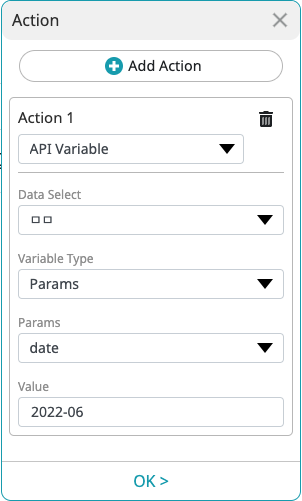

`API Action - Client` is an API for embedding SCLAB Studio as iframes or loading a user's web service as an iframe in the context of using it.
This is a method for communication solely within a web browser.

Please create the Client API in Scrap Studio before you begin.


API Actions and API Events are implemented using [window.postMessage()](https://developer.mozilla.org/en-US/docs/Web/API/Window/postMessage).

## Executing an Action
Running a single action from your iframe. This is an example of running an action when the SCLAB Studio is the parent and your web service is added as an iframe.

```html
<button onclick="window.parent.postMessage('clientAPIIdHere', '*')">A</button>
```

```javascript
window.parent.postMessage('clientAPIIdHere', '*');
```

:::info
You must replace clientAPIIdHere with your API ID. ex) "sW47bBZjYyWGjcfaF"
:::

## Passing Parameters When Executing an Action

You can change the value of variables when executing the "API VARIABLE" action.

| Parameter | Type   | Required | Description   |
|-----------|--------|----------|---------------|
| id        | String | Y        | Client API ID |
| param     | Object | N        | Parameters    |
| header    | Object | N        | Headers       |
| body      | String | N        | body contents |

```javascript
window.parent.postMessage({
    id: 'clientAPIIdHere',
    param: {
        key: "value"
    },
    header: {
        myHeaderKy: "myValue"
    },
    body: JSON.stringify({key: "value"})
}, '*');
```


To change the value of the date parameter in the same way as shown in the screenshot, you can execute the following code.
```javascript
window.parent.postMessage({
    id: 'clientAPIIdHere',
    param: {
        date: "2022-05"
    }
}, '*');
```

## API Event

When sending messages to an iframe from SCLAB, you can use "API Event" in the action. You can set up actions in layouts or maps, for example.


```javascript
window.addEventListener("message", (event)=>{
  if(event.origin !== 'https://yoursitecode.sclab.io'){
    return;
  }
  if(event.data === "MY_DATA") {
    console.log('data received');
  }
});
```

```html
<script>
  window.addEventListener("message", (event)=>{
    if(event.origin !== 'https://yoursitecode.sclab.io'){
      return;
    }
    
    if(event.data === "MY_DATA") {
      document.getElementById("msg").innerHTML = "clicked";
    }
  });
</script>
<div id="msg">
  HI
</div>
```