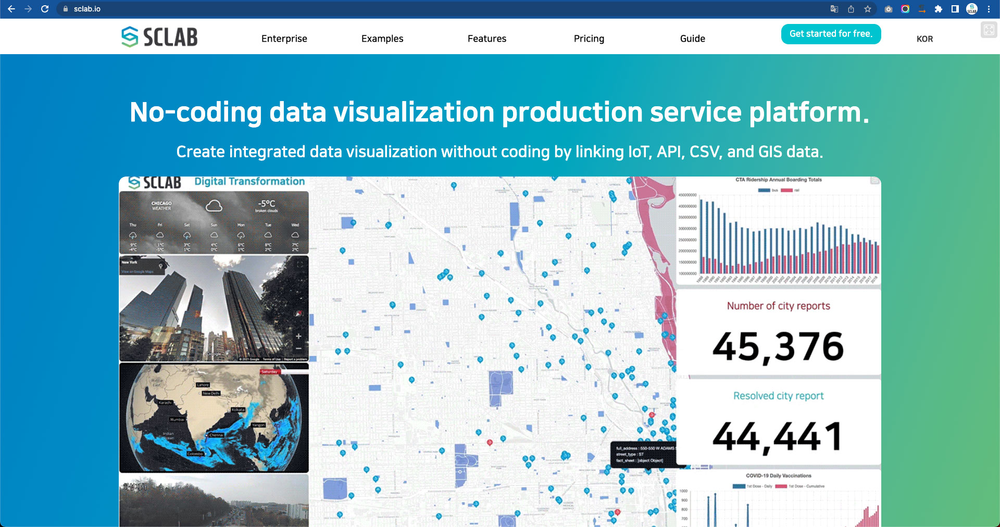
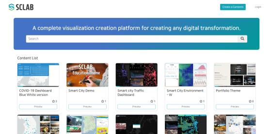
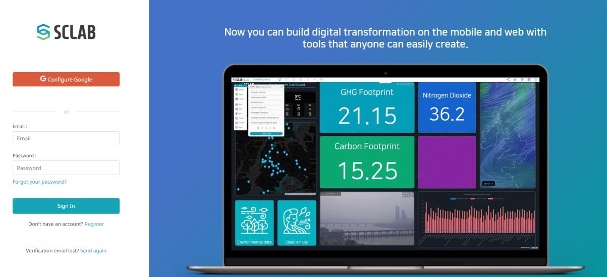
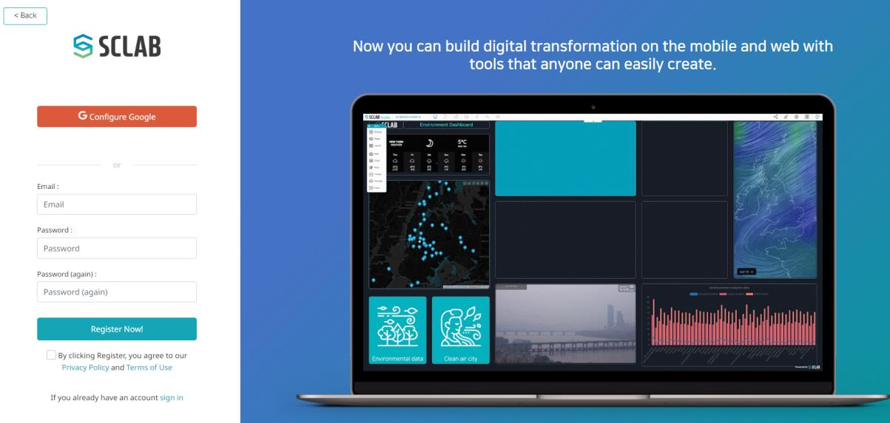
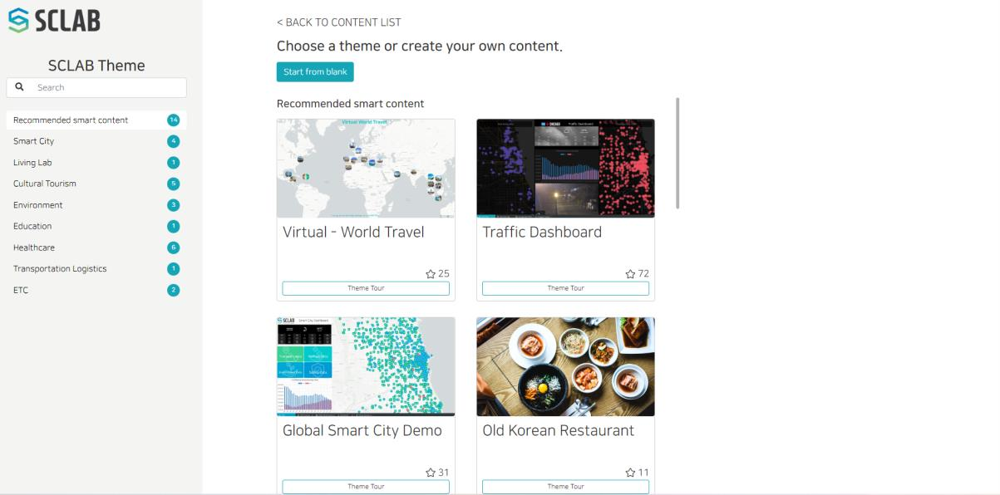
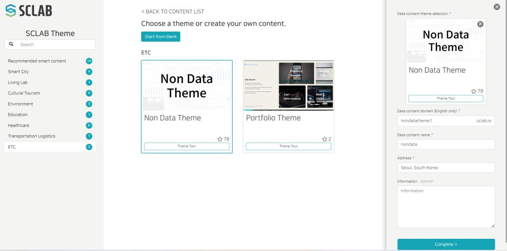

https://www.sclab.io/p/SCLAB_ENG 
Access the SCLAB website address.

 

To log in to SCLAB or create an account, click the 'Get Started for free' or 'Login' button at the top right of the homepage or various content pages.

If you do not have a login account, click 'Register' below on the membership registration screen.

You can create a SCLAB account by entering your email account and password or using your Google account. Check Privacy Policy and Terms of Use at the bottom. After clicking 'Register Now!', go to the registered e-mail address and check your e-mail to complete the registration.

After logging in, click the 'Create a Contents' button on the top right of the page or on My Content List. Then you can move on to the page you can create a data content site.

When you select the theme category you want, the theme list appears in the center. If you click the 'Theme Tour' button at the bottom of the theme, the theme site opens in a new tab, and you can check the theme configuration.

When you select a theme, a window for entering content information appears on the right. After entering information and clicking the 'Complete' button at the bottom, SCLAB Studio to edit data content starts. 'Data content domain' can only be entered in English without any space. Domain address cannot be modified once it is set, so set them carefully. Choose 'Non Data Theme' here.

The first screen of SCLAB Studio is a tutorial, starting with an essential function tutorial.
If you want to learn the tutorial again, click the tutorial icon in the upper right corner to start the tutorial.

In SCLAB Studio, tooltips are exposed when you mouse over each menu for easy understanding.

https://app.sclab.io/ 
