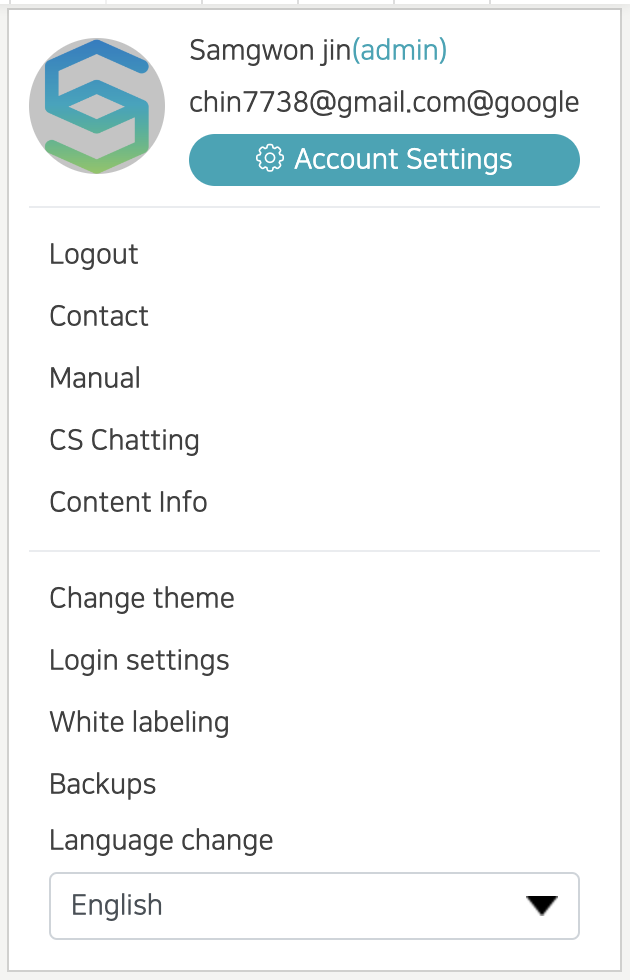

- Click the gear icon in the upper right corner of the screen. The user's thumbnail image, username, and email information are displayed at the top of the settings.
- Account Settings: You can request an account name, add a thumbnail, change the password, and delete the account.
- Contact: You can contact us by e-mail.
- Manual: A new window opens, and you can see the manuals related to using the SCLAB program.
- CS Chatting: You can contact the SCLAB CS manager through chat.
- Content Info: When clicked, the corresponding content information is displayed as a pop-up. If you upload an image, the content representative image displayed on the web or mobile is modified. Content titles and information can also be modified. The applied theme can also be changed, but if you change the theme, all current data will be deleted. When a content deletion request is made, the corresponding data is permanently deleted.
- Change theme: You can also change the content theme here.
- Login settings: You can set the login method with Kakao/Google/ID.
- White labeling: Change logo, favicon, domain (contact the administrator for domain change), etc.
- Backup: The entire site file (design, data, etc.) can be backed up as a compressed file and restored with the backup file.
- Language change: Korean, Español, हिन्दी, English, Português
