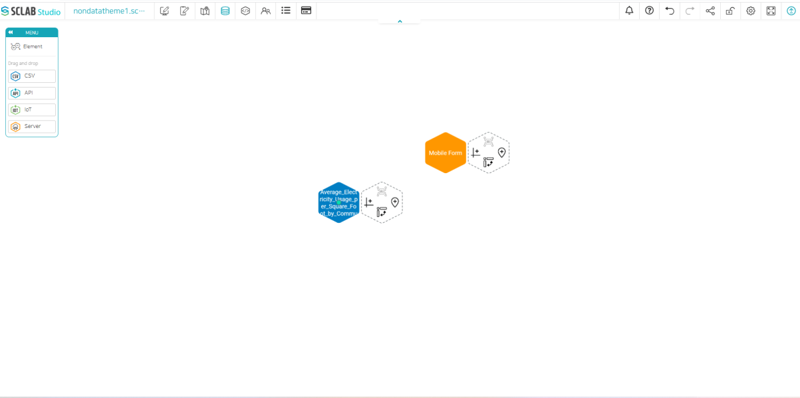
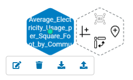

- If you drag and drop the CSV icon and drag it, a screen to open the file appears.
- You can load a file previously stored on your computer or download public data open to citizens(ex) Chicago Data Portal.

- When you load a file, a hexagon-shaped icon appears. The file name is displayed on the left hexagon, and the right hexagon is a toolbar for creating locations, charts, and pivots. If you click the center of the left hexagon, a green circle appears in the center, and you can move the icon by clicking and dragging it.
  

- If you click the hexagon on the left, four icons appear. The first icon is a title modification, the second is a deletion, the third is a file download button, and the fourth is a reupload button.
  