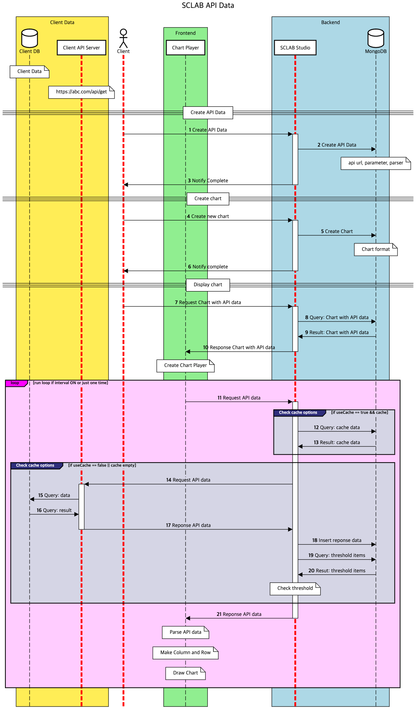

- If you drag and drop the API icon, a pop-up window will appear as shown above.
- Enter the API name, enter the API address next to GET, and click Send.
- Detailed data appears on the Pretty side below.
- If the desired data type does not appear on the right, find the Root and Path of the desired data under Pretty, enter it, and click the A-shaped button. Click the arrow button next to the left number under Pretty and find the root name of the upper level containing the desired data. And find the necessary detailed data in which part under the upper root name. Enter 'Root name' and 'path name' corresponding to the right Root path column and click the A-shaped button. You can see that additional data paths and labels are entered.
- You can select the polling cycle in minutes. No polling means fetching data only once.
- If you enter the API name and press SAVE, you can see that API data is generated and one more turquoise hexagon is created.
- The FIXED-type parameters are only used when sending a request and cannot be accessed by the client-side, so you don't need to worry about the exposure of key values or any other concerns.
  

<iframe width="100%" height="640" src="https://www.youtube.com/embed/39EXX0toy4s" title="YouTube video player" frameborder="0" allow="accelerometer; autoplay; clipboard-write; encrypted-media; gyroscope; picture-in-picture; web-share" allowfullscreen></iframe>

  

## API Data Flow
