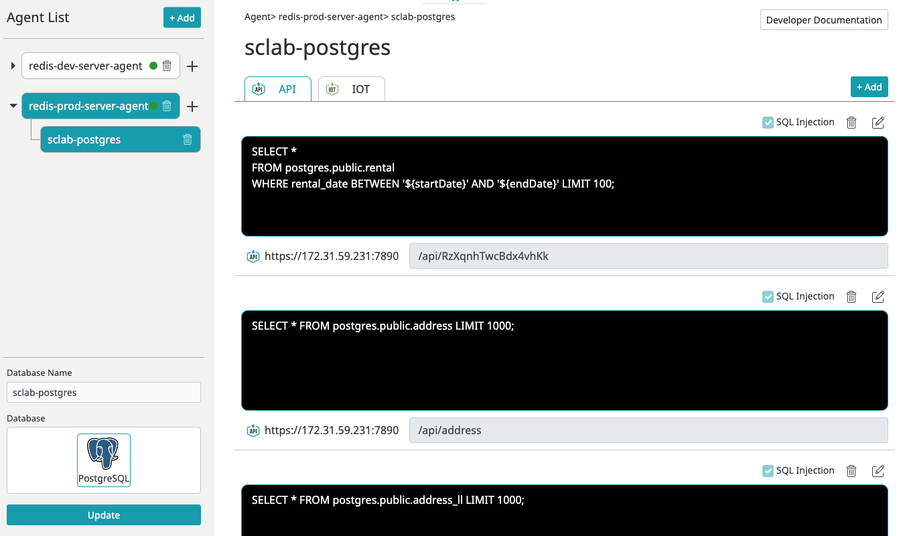
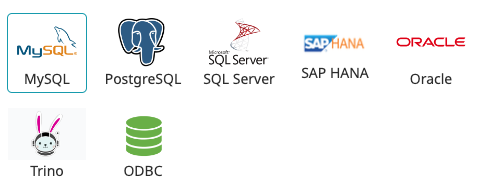
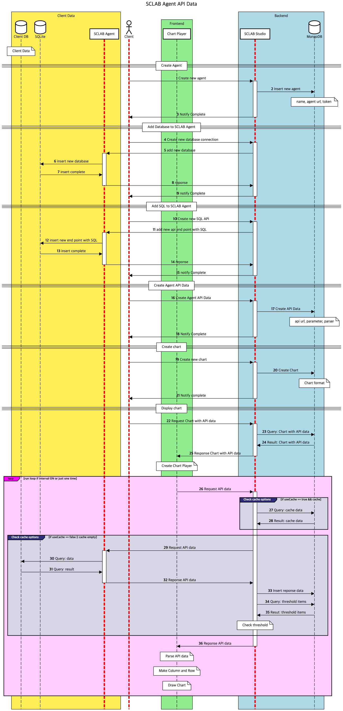

- You can retrieve data from the customer's database using SQL queries through scraping.
- Even if you're not familiar with SQL, it's easy to use through AI assistance.
- It can connect to various data sources such as MySQL, Postgres, SQL Server, SAP HANA, ORACLE, Trino, ODBC, and more.

## Agent installation

- It can be easily installed using Docker.

[https://hub.docker.com/r/sclabio/sclab-agent](https://hub.docker.com/r/sclabio/sclab-agent)

## SCLAB Agent Data Flow

