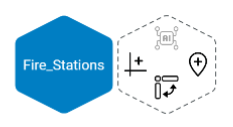
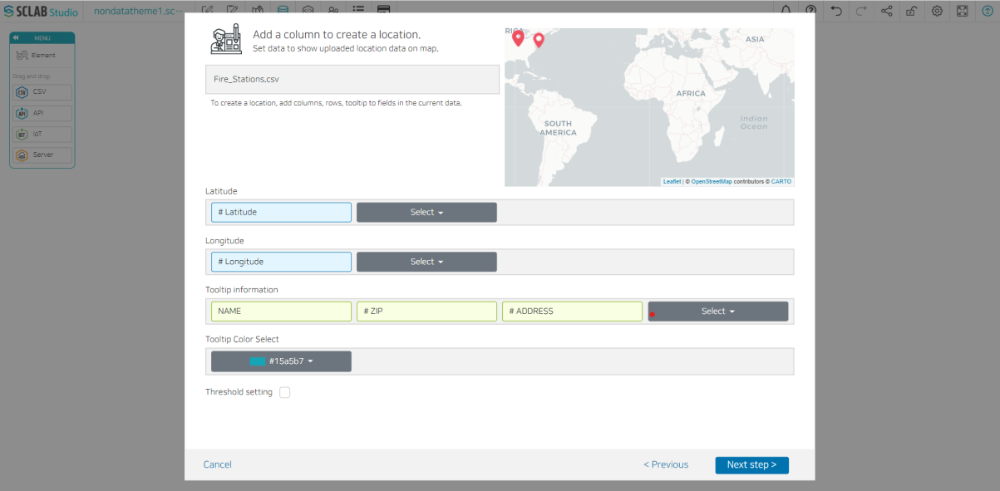
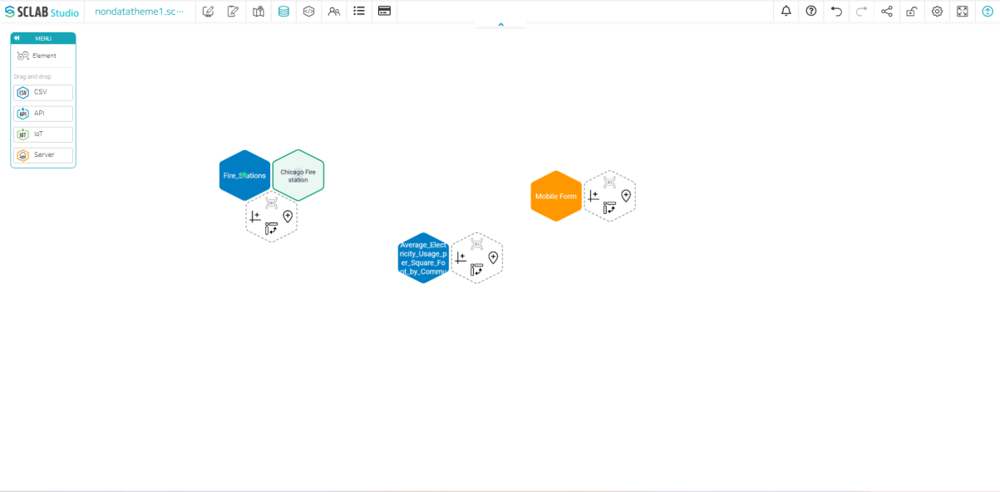

- Drag the CSV icon to load the Chicago Fire Station location information CSV file.
- In the generated CSV hexagon, first click the inverted water droplet-shaped icon on the right hexagon to create location data.

- Add a new location icon by clicking the Upload Location Icon button or select one location icon in the Location list and proceed to the next step.
  

- Select latitude, longitude, tooltip information, and tooltip color. Click the Next Step, enter the location name, and save the location. Location data is generated. If you look below, you can see that a light green hexagon has been added.

  