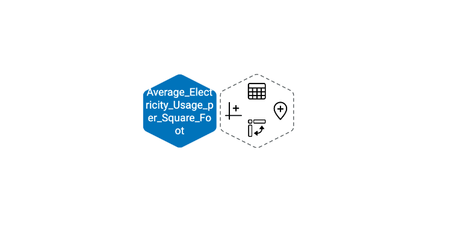
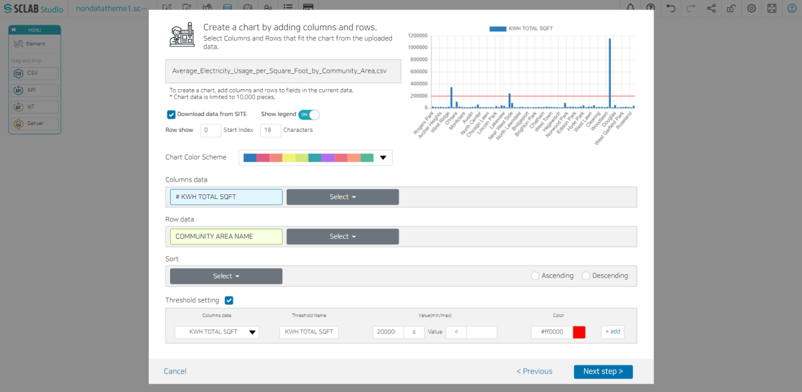

- Click the left icon that looks like a graph from the right hexagon of the blue hexagon icon of the CSV data you created.
 

 
- Select the chart type you want to create and click Next Step. Here, we select Bar Chart (White version).
  

- If you check 'Download data from SITE', people can download the data later.
- Select whether to expose the legend of the chart.
- You can adjust the starting point and the total number of characters displayed in the row.
- Select a chart color combination from the chart color scheme.
- After selecting column data and row data, click Next step.
- If necessary, you can arrange the data in ascending or descending order or set a threshold. Set the data to set the threshold and the threshold name, value, and color.
- Preview the chart to be displayed in the upper right corner.
- After checking the chart, enter a chart name and press SAVE to create chart data, and you can see that there is one more hexagon next to it.

  