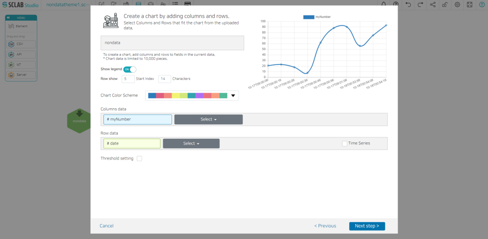
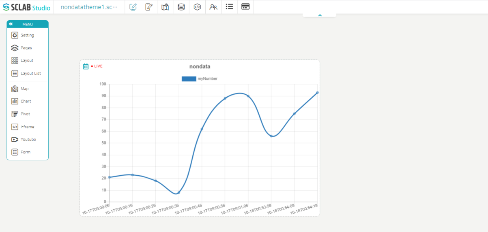

- Select the chart icon to the right of the yellow-green hexagon that was just created.
- Choose a line chart (white version) among the chart types and click the Next step.
- IoT charts are available in real time. If you check the Time Series, when you drop the chart in the layout, you can search by time/date interval with LIVE display as shown below.
  

- Set the data to set the threshold and the threshold name, value, and color.
- Click Next Step, check the chart, and then click the Save button.
- You can see that one more chart icon has been created to the right of the yellow-green IoT hexagon icon.

  