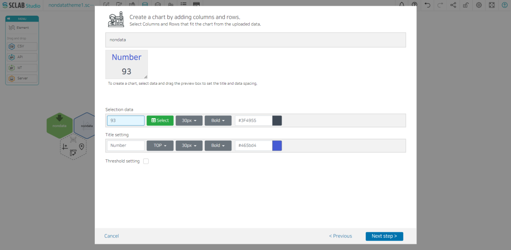
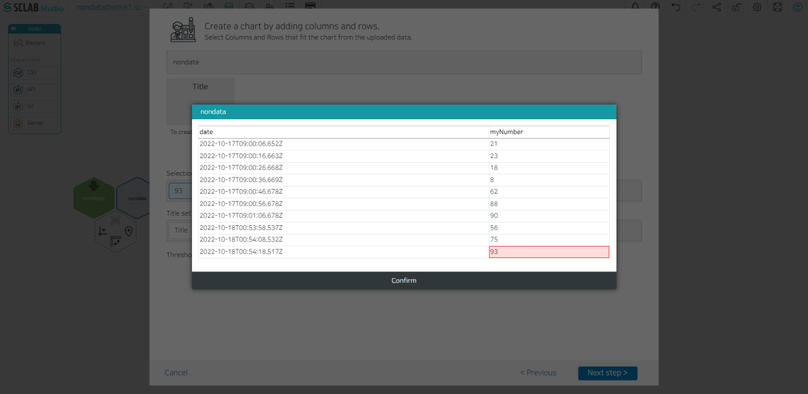

- Select Number Chart from Chart Type and click Next Step.
- Click the green select button to select the data to be displayed on the chart. Here, if you select the last number 93 as shown in the picture below, the last number will always be displayed in the number chart. If you select the first number 21, the first number is always displayed.

  

- Select the color of the data, the name and color of the title, and adjust the size of the number chart at the top.
- Next, enter a name for the number chart, check the chart, and click the Save button.
- You can see that there is an additional number chart icon under the chart icon created earlier.

  