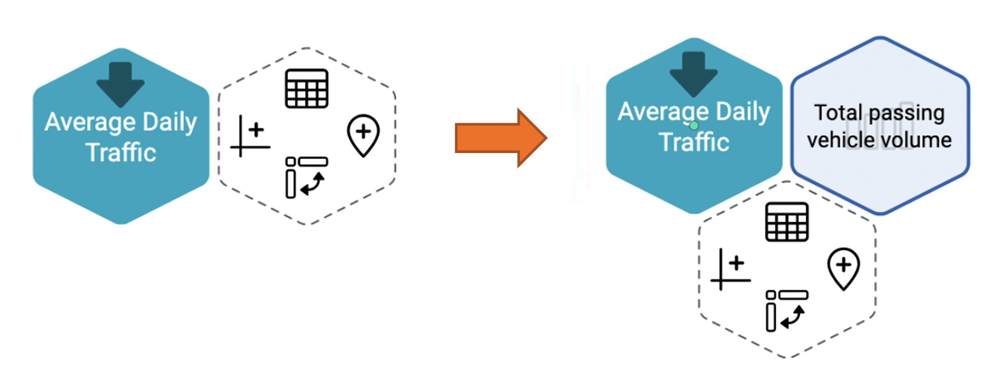

- Click the chart shape on the left from the hexagon icon on the right of the API hexagon icon, select Bar Chart (White version), and next step.
- Set the number of characters to be displayed in row data and select data to be applied to column data and row data.
- Check the chart, set the chart name, and save.
- Check that the chart data has been added to the right of the API hexagon icon.

  
