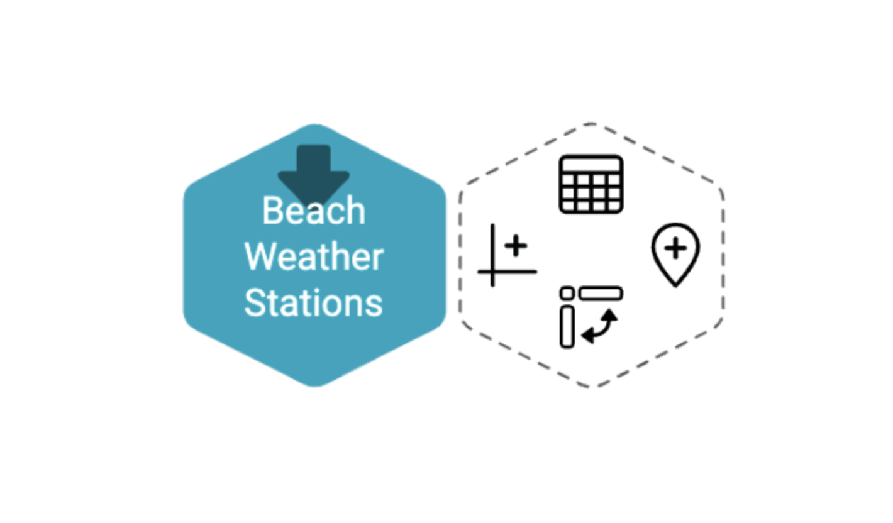
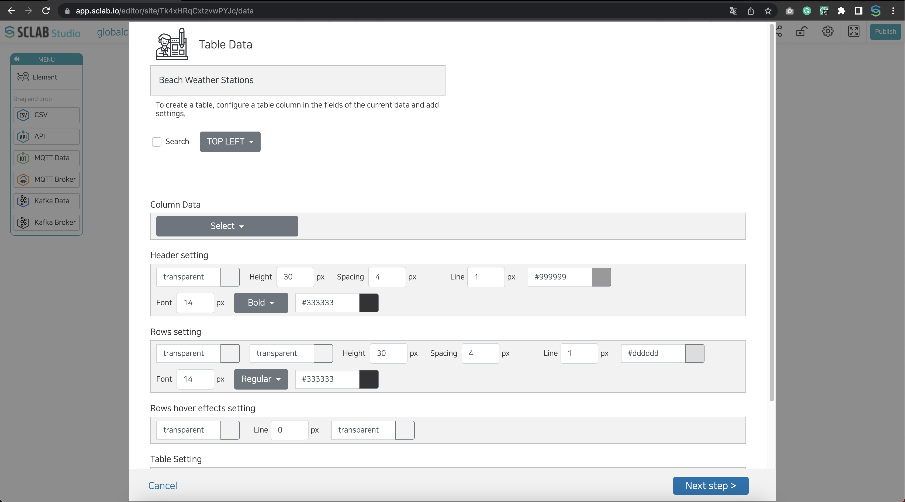
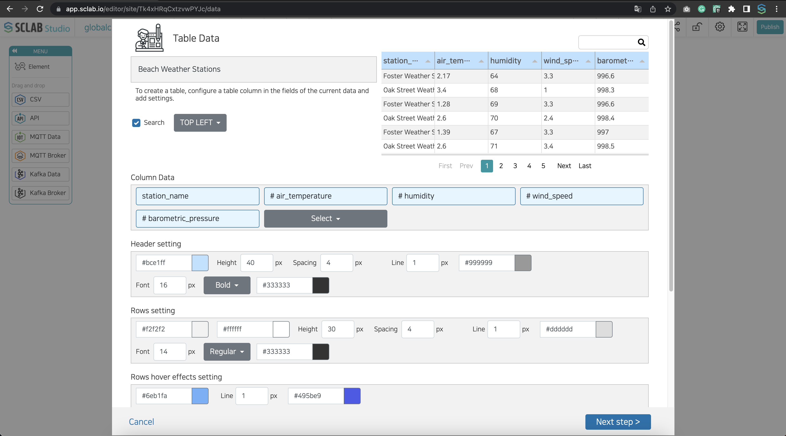
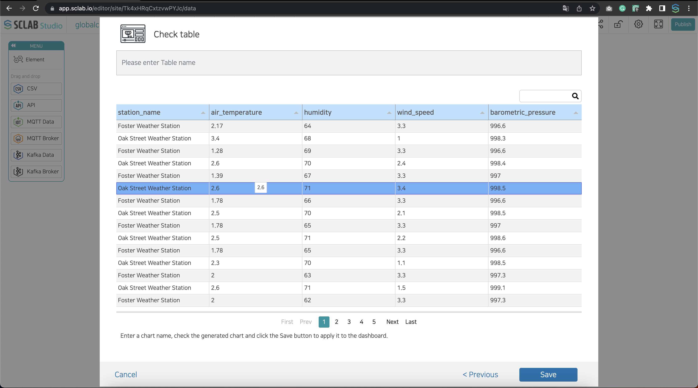
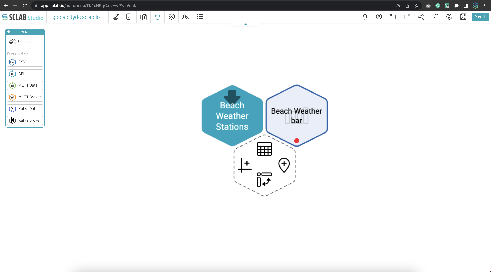

- Import API, IoT, and CSV files.
- Let's create a data table by clicking the table icon at the hexagon's top.
  

- Set column selection, table header, row, hangover effect, table-border, paging, and threshold to visualize API, IoT, and CSV data in a table format.
  

- Search: Set whether to expose the function of the search button for the data in the data table and the location of the search exposure.
- Column selection: Tables are created from left to right according to the selection order.
- Table header settings: Set the background color, height, spacing, line thickness and color, and font size, style, and color of the table header.
- Row settings: Set the background color, height, spacing, line thickness, and color, font size, style, and color of even and odd rows.
- Set the hangover effect: Set the row color, border thickness, and color when the mouse is over.
  

- Table border setting: Set the table border thickness and color.
- Paging: You can set the page to scroll and to page and select and set the paging at the bottom from the 5, 7, and 10 buttons.
- Threshold setting: Threshold setting is the same as other charts, and alarms and actions can be applied.
  

- The number of data rows displayed in a table varies depending on the layout.
- After checking the preview of the set data table, enter the table name and save.
  

- You can see that a chart icon is created to the right of the hexagon icon.

  