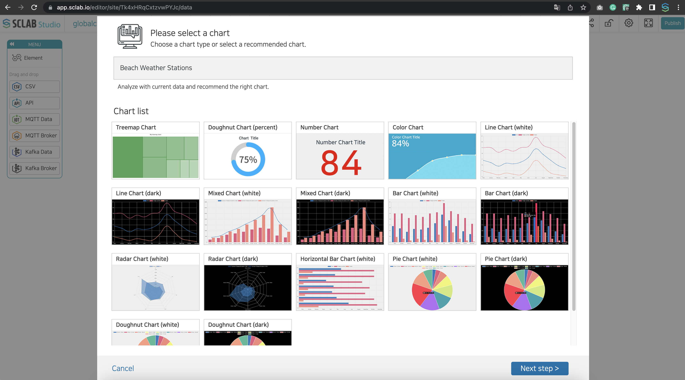
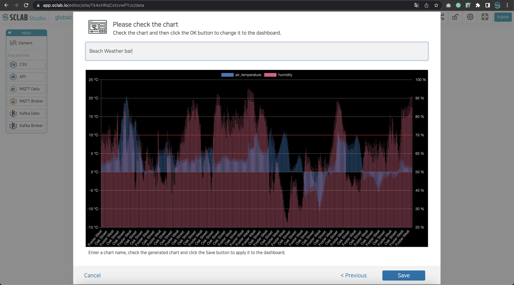
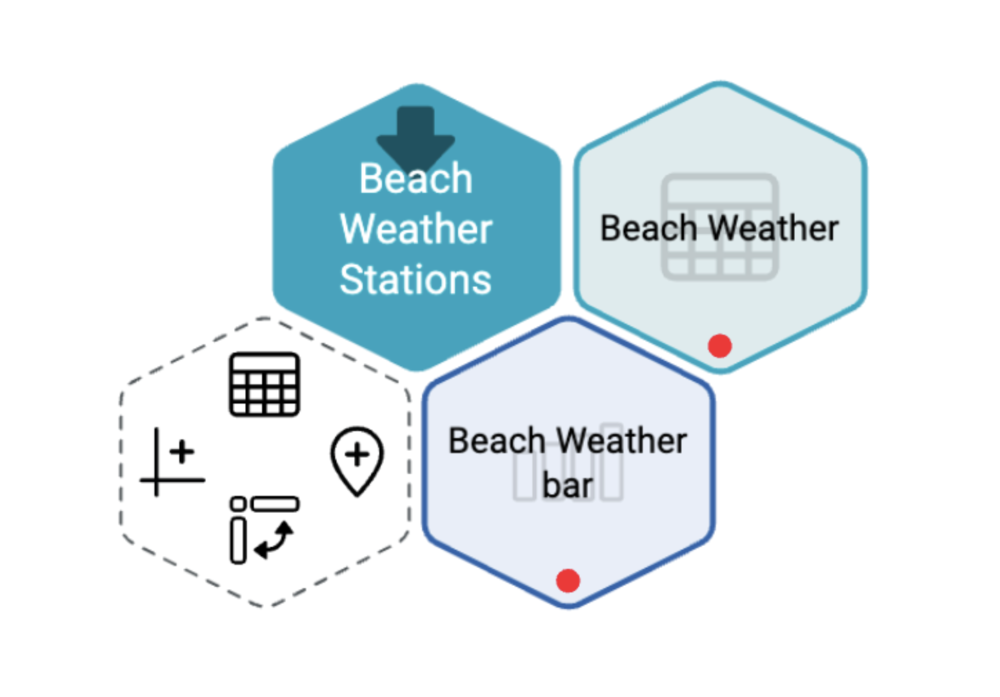

- Click the chart shape on the left of the hexagon icon on the right of the hexagon icon of API, IoT, and CSV files.
  

- •	Select the type of chart you want to create and click Next Step. Here we choose Bar Char.
  

- Select whether to expose the legend of the chart.
- You can adjust the starting point and the number of characters shown in a row.
- Select a chart color combination from the chart color scheme.
- If you check the multi-axis at the top right of column data, the column data method at the bottom changes to the multi-column data method setting method.
- If you select data from column data and enter a unit, the unit appears in multi-column data.
- If you select the data you want to set as chart 0 at the top right of the column data, the chart standard is set.
- Select row data.
- If necessary, data can be arranged in ascending or descending order, or a threshold can be set. Set the data to set the threshold, name, value, and color of the threshold.
  

- After checking the chart, enter the name and click the Save button.
  

- You can see that a chart icon is created to the right of the hexagon icon.

  