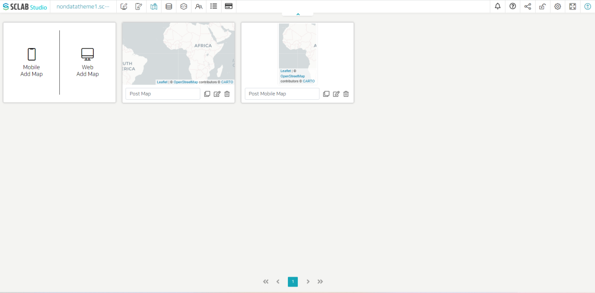
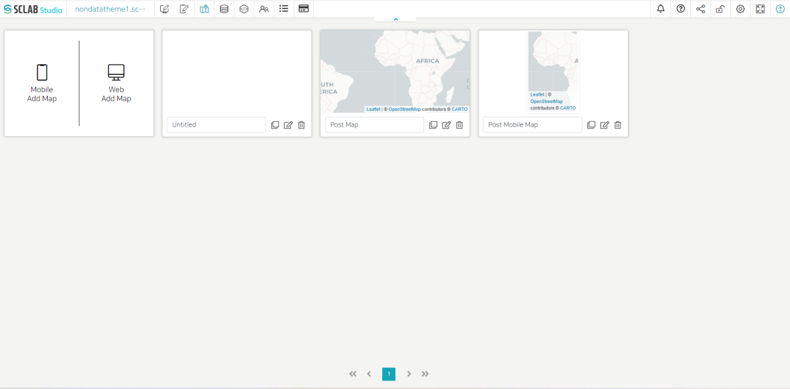
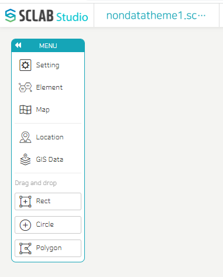

- Maps can be created by selecting a mobile map or a web map.
- Maps can be managed through the Copy, Edit, and Delete buttons below.
  

- Click the Web Add Map button.
- A new rectangle is created as shown below.
  

- After entering the map name in the blank, click the Edit button on the right.
- The following map menu appears.
  

- Select the desired map shape from the left Map menu and set the data to apply the map of the selected shape from the location or GIS data item.
- Look at each map menu first and see how to make a map by example.
  