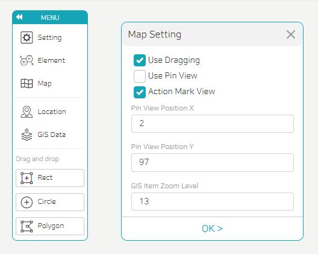

- If Use Dragging is checked, drag can be used on the published screen.
- If you check Use Pin View, an eye icon appears in the set position. This means that the eye icon appears in the same position on the published screen, and when you click this icon, only the map you want to display on the screen among multiple maps is selectively displayed.
- Pin View Position X/Y: Set the X-axis/Y-axis coordinate position of the above-mentioned eye icon.
- You can set an action for each location on the map.
- If an action is set at a specific location, an action mark will appear at the set location. If Action Mark View is checked, the action mark will appear on the published screen as well and the action will be executed when the action mark is clicked. Even if the action mark is not displayed, if you click the location where the action was set, the action is executed.
- Although the maximum and minimum values of the GIS zoom level are different for each map, the smaller the number, the larger the map appears.
  