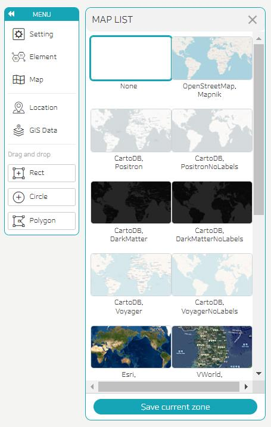

- You can select the map you want to use as a background.
- If you click the Add Custom Map button at the bottom, you can apply a custom map. If you click Save current zone, the area of the current screen is saved and displayed as a representative screen.
  
