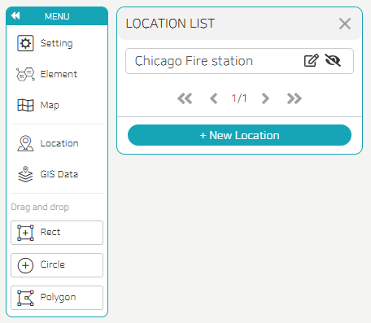

- The list of location data created through the data editor appears, and by activating the right eye icon, it can be exposed on the map.
- If you press the edit button, you can go to the data editor and edit the location data.
- Press the New Location button to go to the data editor and add a location.
  