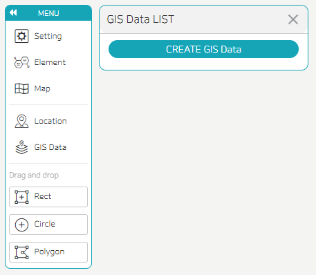
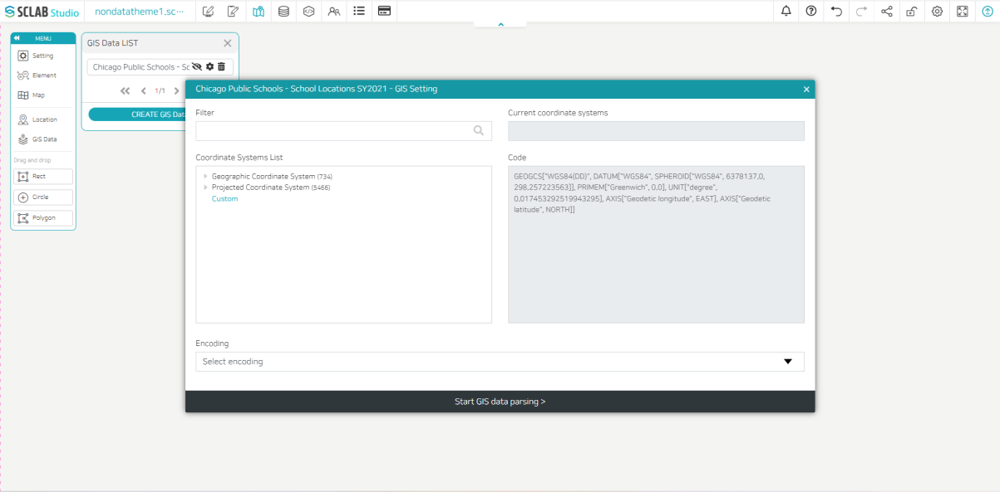

- GIS data can be exposed on the map. A list of GIS data currently imported is displayed. You can import additional GIS data by clicking CREATE GIS Data.
- When you load GIS data, you can see that it is added as follows. You can select the coordinate system and encoding by clicking the settings button to the right of the data.
  

  