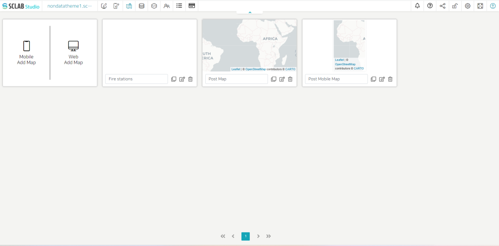
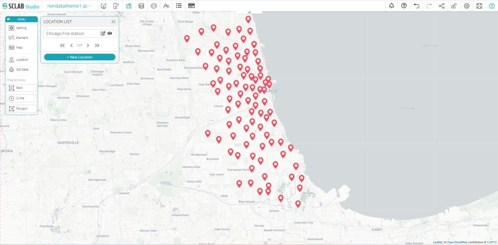
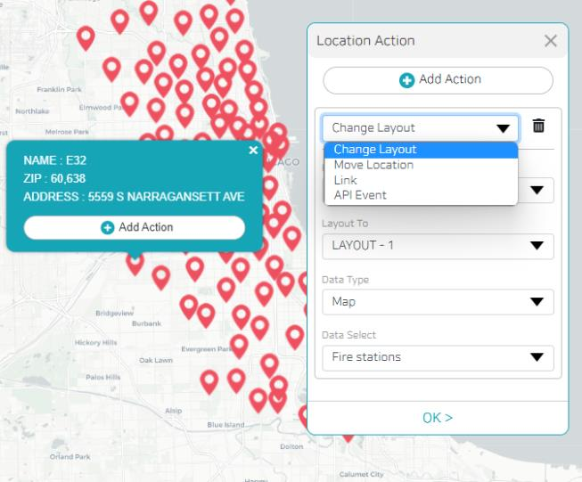

- Add a web map in the map editor, edit the title, and click the edit button on the right. The map menu list described above appears.
- Click the map item and select the map with the desired background. Because it is Chicago Fire station information, enlarge the map so that Chicago city can be seen larger, and then save the current location.
- Select the data to be applied to the map from the location menu and deactivate the eye shape for the rest of the locations. Go back to the map menu and save the current location.
- If you go back to the map editor and check it, you can see that it was applied as the last saved image.
  

- If you select one of the locations, detailed information about the location is displayed, and you can add actions to it. When an action is added and the location is clicked on the open screen after publication, the action is executed.
  

- Select the desired map shape from the left Map menu and set the data to apply the map of the selected shape from the location or GIS data item.
- Look at each map menu first and see how to make a map by example.
  