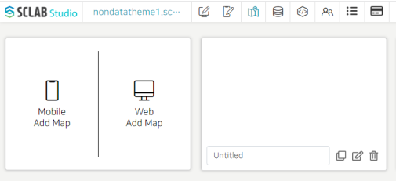
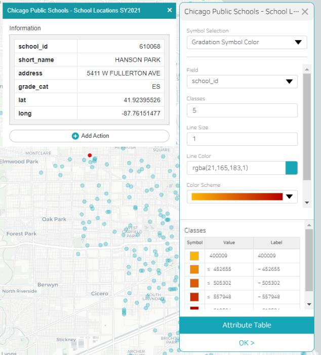

- Add a web map in the map editor, edit the title, and click the edit button on the right. Click the map item and select the map with the desired background.
- Since it is Chicago public school location information, enlarge the map so that Chicago city can be seen larger, and then save the current location.
- Click the CREATE GIS Data button to load the saved GIS data.
- If you deactivate the location data activated above, it appears as follows.
  

- Go back to the map menu and save the current location. If you go back to the map editor and check it, you can see that it was applied as the last saved image.
- The GIS data also displays detailed information about a location when you click on one of the locations, and you can add an action to this location.
- In the GIS data list, you can additionally add a gradient to the corresponding symbol.
  

- Just select the Gradation Symbol Color in the Symbol Selection. Gradation level and color scheme can also be selected. Single symbols can also be set in color and line thickness.
  