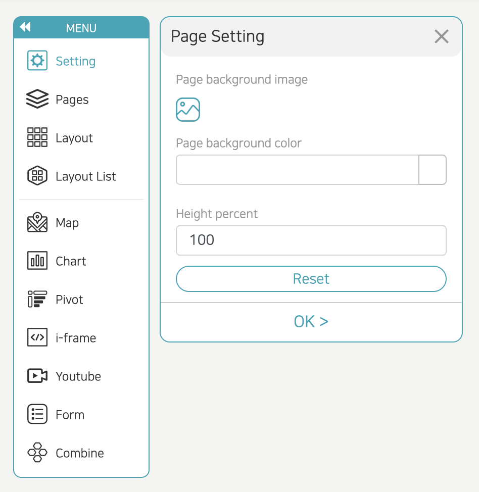

- If you click the 'Setting' menu, the 'Page Setting' window appears.
- Page background image: You can insert an image to use as the background of the current page screen.
- Page background color: Select a color to use as the page background
- Height percent: Default 100 can be set to 100 or higher; you enter a larger number; the vertical length of the screen is extended and can be moved by scrolling.
  