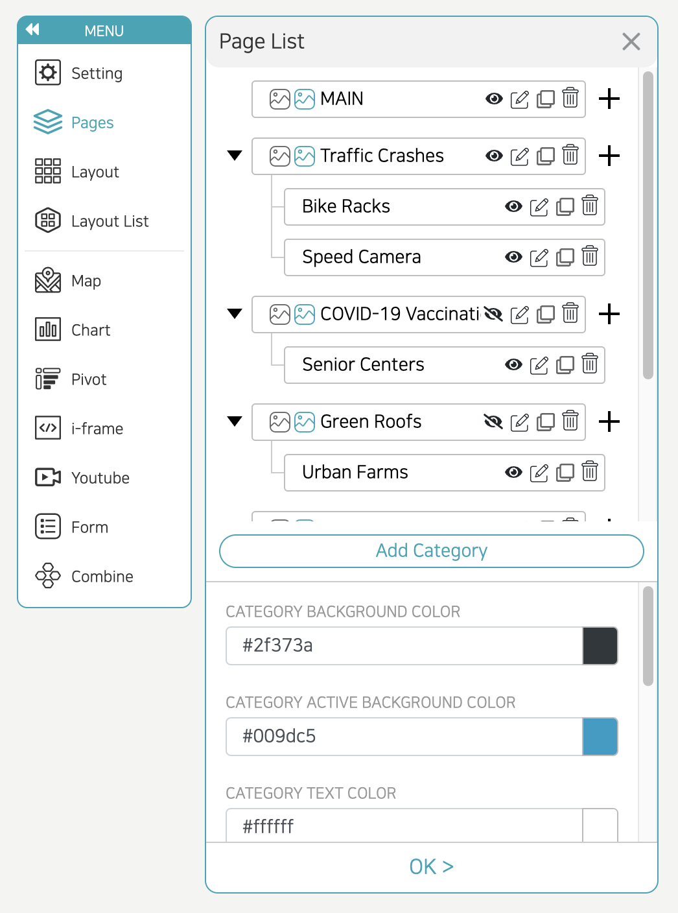

- When you click the 'Pages' menu, a window titled 'Page List' appears.
- Click the button labeled 'Add Category', categories are added, and you can create multiple pages.
- You can put an image next to the category name by tapping the mountain-shaped icon. A gray icon is an image that appears when another category is selected, and a blue icon is an image that appears when the category is selected. You can delete it by re-selecting the icon after inserting the image.
- You can set the category name in the column next to the mountain icon.
- If you select the eye icon, you can hide or show the corresponding category page.
- Then, when you click the edit icon, you can go to the corresponding category page and edit the screen configuration.
- Click the copy icon to copy the page. The delete button is used to delete the page
- The right-most + button is used to create a subpage.
- Category background color: Set background color and transparency when the category is deactivated.
- Background color when the category is activated: Set background color and transparency when the category is activated.
- Category text color: You can set the category name color and transparency.
- Category transparency: Set the transparency of the category background (1 to 100).
- Category position: Decide where the category will be placed on the page.
- Category use: If you choose not to use a category, the category is not displayed.
  