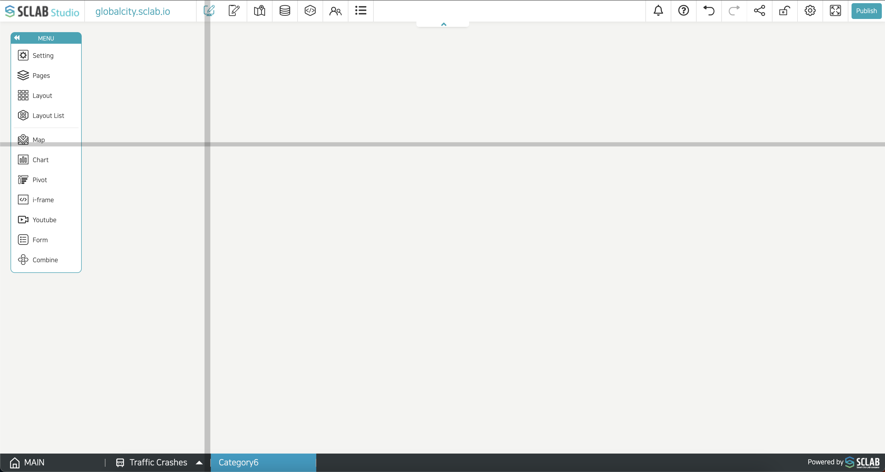
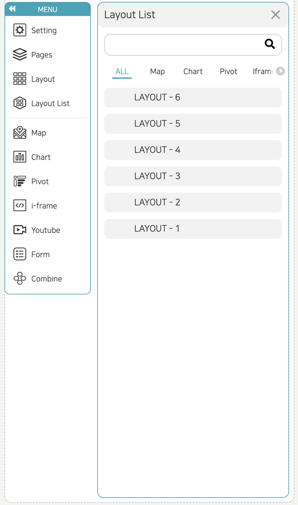

- If you click the Layout menu, a cross-shaped guideline appears. Depending on this guideline, you can designate the layout area by dragging.
- Clicking any one place corresponding to the layout area activates the management menu at the top right.
- When you click the first 'Resize' button, the cross guideline appears again, and you can resize and re-adjust the layout size and position. Then click the broom-shaped button to delete the data in the corresponding layout. The layout remains undeleted. Click the third/fourth button to bring it up/down if multiple layouts overlap. Various layout settings can be made through the setting button. I will explain this in detail below. Pressing the last trash can-shaped button will delete the layout completely.
- Consider the arrangement of various types of data (charts, maps, iframes, Youtube, titles, etc.) on the entire screen and configure the layout by dragging.
  

- You can see the list of layouts on the current page. If you click each layout item, the corresponding layout is selected, and you can edit the layout.
  