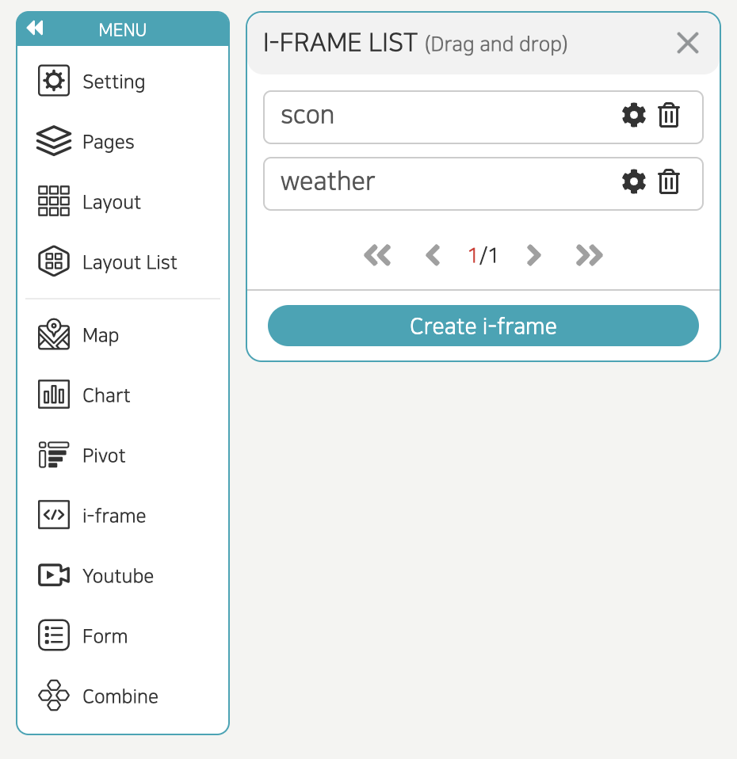
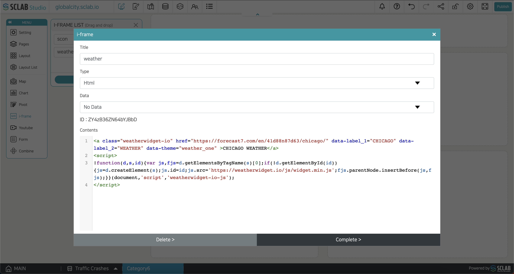

- All the current i-frame lists are displayed, and i-frames can be imported into the layout by drag and drop. If you click the edit icon, you can edit the i-frame.
- If you click the trash can icon, the i-frame is deleted, and the content applied to the layout is also deleted.
- The weather widget, time widget, CCTV, road view, web page, etc., can be applied to the layout using the i-frame.
- If you click the i-frame icon and click the 'Create i-frame' button in the i-frame list, the following pop-up appears.
  

- After entering the title, select from two methods, Address and Html, enter it in the Contents area, and click the 'Complete' button to add it to the i-frame list.
  