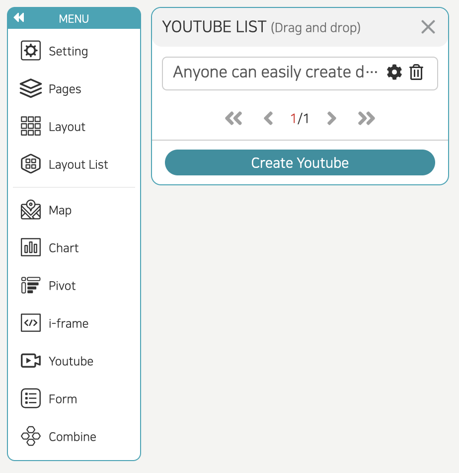
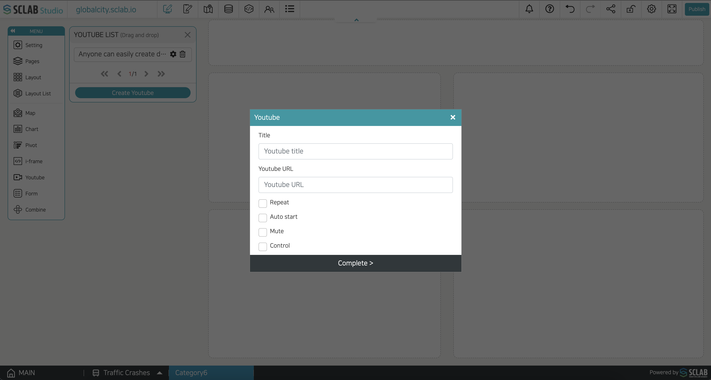

- All currently connected YouTube lists are displayed, and YouTube can be imported by drag and drop. You can edit YouTube by clicking the setting icon.
- If you click the trash can icon, the YouTube is deleted, and the content applied to the layout is also deleted.
- You can add YouTube by clicking the 'Create Youtube' button below.
  

- Title: Enter the YouTube title.
- Youtube URL: Enter the YouTube Internet address.
- Repeat: YouTube is played repeatedly.
- Auto start: It plays automatically without pressing the Play button.
- Mute: When played, the sound is removed.
- Control: When unchecked, the playback control and setting bar below YouTube does not appear.
  