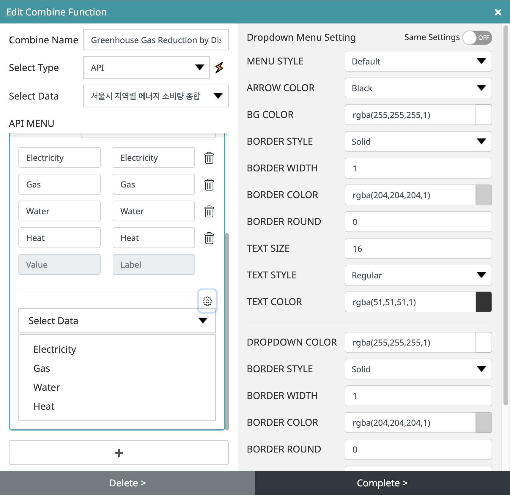

You can create dynamic data visualizations by creating tabs, dropdowns, and calendar menus for charts that work with REST API.
   

To create a combine, click the ‘Create combine function’ button, and a pop-up to create a combine will appear.
   

- Enter the combine name and select the data type. (Currently, the API is supported.)
- Select data to create a combine. Data can be selected from API data linked to the data editor.
- If you click the ‘+’ button at the bottom, an API menu that can create a combine appears, and when you select one of the radio buttons that allow you to select a tab, dropdown, or calendar, you can configure the corresponding detailed settings.
   

## 1.	Dropdown

- Enter the name to be used in the drop-down menu.
- Select the data type among ‘Params’, Headers’, and ‘Body’.
- Select the ‘Key’ of the selected data
- Data selection can select values and levels manually and automatically.
- You can manually select the data selection and directly input the value and level when selecting manually.
- When selecting data selection automatically, select data that can automatically link values and levels.
- After selecting and entering data, you can preview the drop-down at the bottom.
- Click the + button at the bottom to add a different combine menu with the same data.
- If you click the Settings button at the top right of the drop-down menu, you can set the design of the drop-down menu.
- When the setting is complete, click the OK button at the bottom to add it to the combine list.
- When deleting, click the relevant combine and click the delete button at the bottom to delete.
   

- This is the drop-down menu setting area, where you can set the design you want other than the default drop-down.
- Menu style: Choose from basic, transparent, white, and dark styles
- Arrow color: Select the color of the arrow drop-down button from black, gray, or white.
- Background color: set the background color
- Border Style: Select a border style from None, Solid Line, Dotted Line, or Dot.
- Border Thickness: Set by entering the thickness of the border
- Border color: set the color of the border
- Rounded border: set by entering the roundness of the corner
- Text size: Set by entering text. Depending on the size, the thickness of the drop-down also varies.
- Text Style: Choose a text style from Light, Regular, Bold, Black, Light Italic, Regular Italic, Bold Italic, and Black Italic.
- Text color: Set the text color
- Background color: set the background color of the drop-down
- Border Style: Select a border style from the drop-down from none, solid line, dotted line, or dotted line.
- Border thickness: set by entering the thickness of the border in the drop-down
- Border color: set the color of the border of the drop-down
- Rounded border: set by entering the roundness of the corners of the drop-down
- Text size: Enter and set the text of the drop-down, and the thickness of the drop-down also varies depending on the size.
- Text Style: Select the text style in the drop-down from Light, Regular, Bold, Black, Light Italic, Regular Italic, Bold Italic, or Black Italic.
- Text color: Set the text color of the drop-down
- When creating multiple combines from the same data, if the same setting is applied to the top right of the menu setting, the setting value applied at the top is the same.
   

## 2.	Tab

- Enter a name to be used as a tab.
- Select the data type among ‘Params,’ Headers’, ‘Body.’
- Select the ‘Key’ of the selected data
- Data selection can select values and levels manually and automatically.
- You can manually select the data selection and directly input the value and level when selecting manually.
- When selecting data selection automatically, select data that can automatically link values and levels.
- After selecting and entering data, you can check the tab at the bottom in advance.
- Click the + button at the bottom to add a different combine menu with the same data.
- If you click the settings button at the top right of the tab menu, you can set the design of the tab.
- When the setting is complete, click the OK button at the bottom to add it to the combine list.
- When deleting, click the relevant combine and click the delete button at the bottom to delete.
   

- In the tab menu setting area, you can set the design you want other than the default tabs.

### Tab, button style
- Menu style: Choose from tab, button, and line styles
- Tab Color: Set the color for Active and Normal status
- Tab round border: Set by entering the round value of each corner of Top_L, Top_R, Bottom_R, Bottom_L
- Tab Spacing: Enter and set the spacing between each tab
- Border style: set the color of Active, Normal state
- Border Thickness: Set by entering the thickness of the border in an Active, Normal state
- Border color: Set the color of the border in Active, Normal state
- Text Style: Choose between Light, Regular, Bold, Black, Light Italic, Regular Italic, Bold Italic, and Black Italic for text styles in Active and Normal states.
- Text color: Set the text color for Active and Normal status
- Text size: Enter text size to set
- Tab icon: Active, normal icons are created according to the number of created tabs
- Icon position: Select the position of the tab icon among Left, Right, Top, and Bottom
- When creating multiple combines from the same data, if the same setting is applied to the top right of the menu setting, the setting value applied at the top is the same.
 

### Line style
- Menu style: Choose from tab, button, and line styles
- Tab Spacing: Enter and set the spacing between each tab
- Line Style: Select Active or Normal line style among none, solid line, dotted line, and dot
- Line Thickness: Enter and set the thickness of the line in an Active, Normal state
- Line color: Set the color of the line in Active, Normal state
- Text Style: Choose between Light, Regular, Bold, Black, Light Italic, Regular Italic, Bold Italic, and Black Italic for text styles in Active and Normal states.
- Text color: Set the text color for Active and Normal status
- Text size: Enter text size to set
- Tab icon: Active, normal icons are created according to the number of created tabs
- Icon position: Select the position of the tab icon among Left, Right, Top, and Bottom
- When creating multiple combines from the same data, if the same setting is applied to the top right of the menu setting, the setting value applied at the top is the same.
  

## 3.	Calendar

- Enter the name to be used as the calendar.
- Select the data type among ‘Params’, Headers’, and ‘Body’.
- Select the ‘Key’ of the selected data
- Select the data type from day or month.
- Select the language to be used in the calendar.
- Enter the basic format of the calendar. For example, if you enter dd/mm/yyyy, yyyy-mm-dd or check the timestamp, it will be displayed in the default format.
- If you enter the default date to be displayed on the calendar or check today, it will be displayed as today.
- You can check the calendar in advance at the bottom.
- Click the + button at the bottom to add a different combine menu with the same data.
- If you click the setting button at the top right of the calendar, you can set the design of the calendar.
- When the setting is complete, click the OK button at the bottom to add it to the combine list.
- When deleting, click the relevant combine and click the delete button at the bottom to delete.
   

- The calendar setting area allows you to set the design you want.
- Background color: set the background color
- Border Style: Select a border style from None, Solid Line, Dotted Line, or Dot.
- Border Thickness: Set by entering the thickness of the border
- Border color: set the color of the border
- Rounded border: set by entering the roundness of the corner
- Text size: set by entering text
- Text Style: Choose a text style from Light, Regular, Bold, Black, Light Italic, Regular Italic, Bold Italic, and Black Italic.
- Text color: Set the text color
- Hide Icon: Hides the calendar icon and expands the calendar area
- Icon Color: set the color of the calendar icon
- Calendar background color: Set the calendar background color
- Day Color: Set the color of the day of the week in the calendar
- Day Color: Set the color for each day of the calendar
- Selected color: Set the color of the selected calendar in Active, Normal state
- Today's color: Set today's color for Active and Normal status
- When creating multiple combines from the same data, if the same setting is applied to the top right of the menu setting, the setting value applied at the top is the same.
   

<iframe width="100%" height="640" src="https://www.youtube.com/embed/39EXX0toy4s?start=684" title="YouTube video player" frameborder="0" allow="accelerometer; autoplay; clipboard-write; encrypted-media; gyroscope; picture-in-picture; web-share" allowfullscreen></iframe>
  