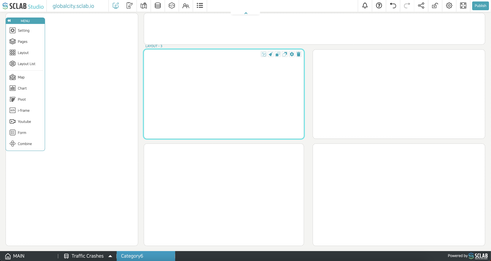

- Name: Set the name of the layout
- Display
⬝ Automatic: If there is no data and there is only color in the layout background, it will not appear on the published screen. If there is data (text and background images too), it will be shown on the published screen.
⬝ Show: Shows on the open screen regardless of data presence or absence.
⬝ Hide: Invisible on the published screen.
- Use fixed scroll position: When 'Use' is selected, the layout remains fixed even if the page screen is scrolled down. 'Do not use' means that the layout is not fixed when scrolling down.
- Image fill method: If you select 'Contain', the aspect ratio of the image is also added to the layout column in the same way as the original image so that the original image can be entered as it is. There may be empty spaces. If you select 'Cover', the image is adjusted and expressed to cover the entire layout. If the aspect ratio of the image and the layout are different, the entire image may not appear.
- Layout: Specify the size and position of the layout rectangle area. In the image below, for example, X min 35.625 Y min 30 is (X-axis coordinates, Y-axis coordinates)
(35.625, 30) on the page. Let's assume that you put a dot at this location. In the case of X max 54.375 Y max 67, let's assume that we have another dot on the same page (54.375, 67).
  

- This is the area of the layout where the rectangle connecting the two red dots displayed on the screen diagonally is set.
- Background color of layout: Set the color and transparency of the entire background of the layout.
- Text: the text to be displayed inside the layout
- Text size: the size of the text in the layout
- Text color: text color, transparency in the layout
- Text style: Light, Regular, Bold, Black (text thickness)
- Text position: The position of the text in the layout area
- Text align: Left/Center/Right/Both Alignment
- Layout transparency: Transparency of all data/background image/text/in the layout is applied at once.
- Padding: When data/background image/text is filled within the border in the layout area, it is filled by leaving the set spacing blank.
- Margin: The border starts excluding the set spacing in the layout area.
- Border style: Choose from a variety of border types.
- Border width: border thickness
- Border color: border color, transparency
- Round: The larger the number, the closer it is to a circle.
- Custom style: You can put something like code separately.
  

