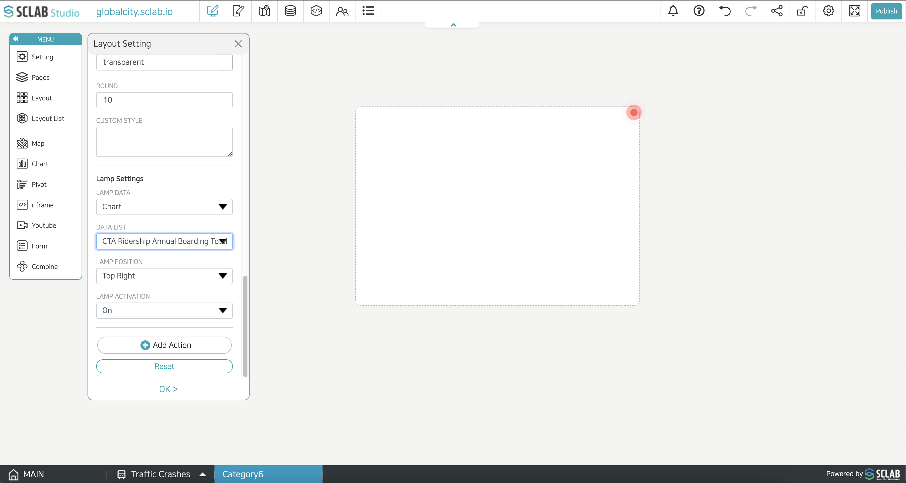

- Lamp data/Data list: Select the data that is the standard for lamp alarm. The color of the lamp is applied differently depending on the threshold standard and color set when creating each chart or location. As the data value changes, the color may change if it corresponds to the standard of a different color.
- When the lamp data is set as a 'Location', the color value of the first threshold value is exposed while checking the data by row.
- Lamp position: Designate the position where the lamp blinks.
- Lamp activation: If 'ON' is checked, the lamp blinks at the set position if the corresponding condition is satisfied.
  