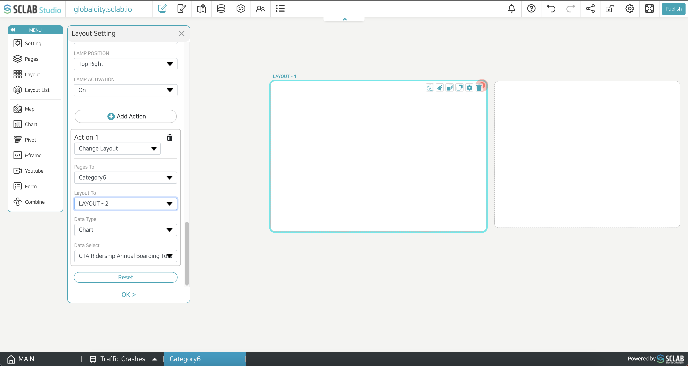

- When the layout is clicked, the set action is applied. If several actions that are difficult to be executed at the same time are added, the action applied to the top of the screen is executed.
- Change layout: The set data is applied to the layout position on the set page.
- Move location: Move to the selected location on the selected map. You can also set the latitude and longitude on the map by clicking the icon below the 'Location Select' and selecting the cursor.
- Link: You can go to the set page or enter the internet address to display the set internet address. You can apply a link to the current page or a new window.
- Let's make a layout configuration that can paste data later as in the example below.
  