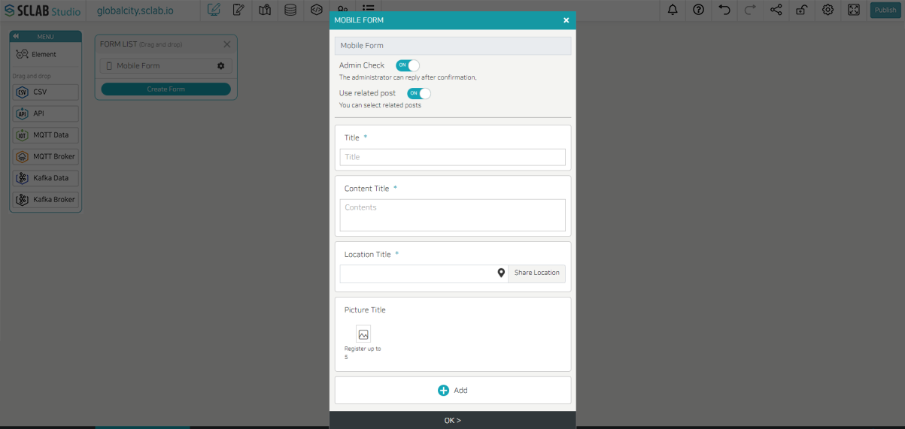
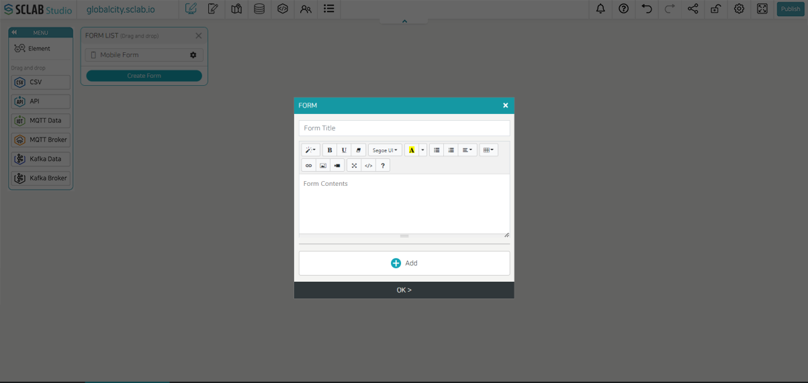
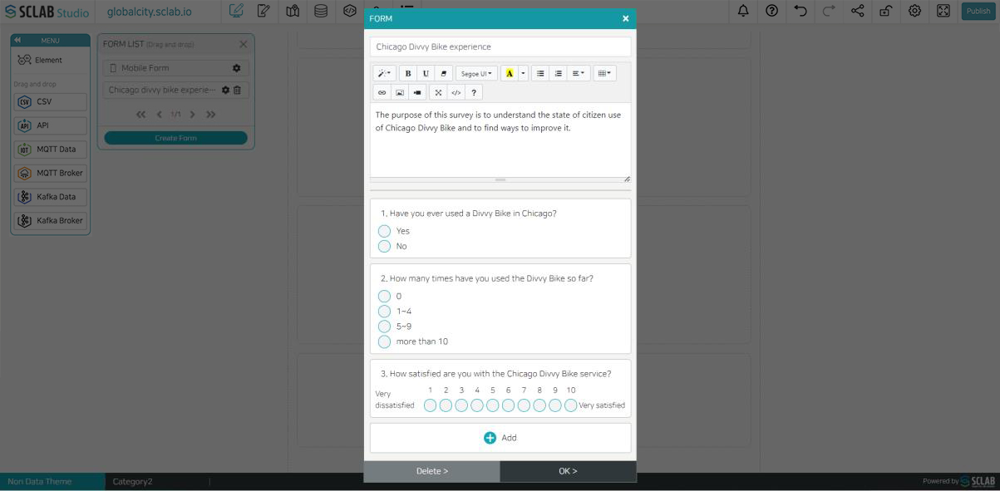
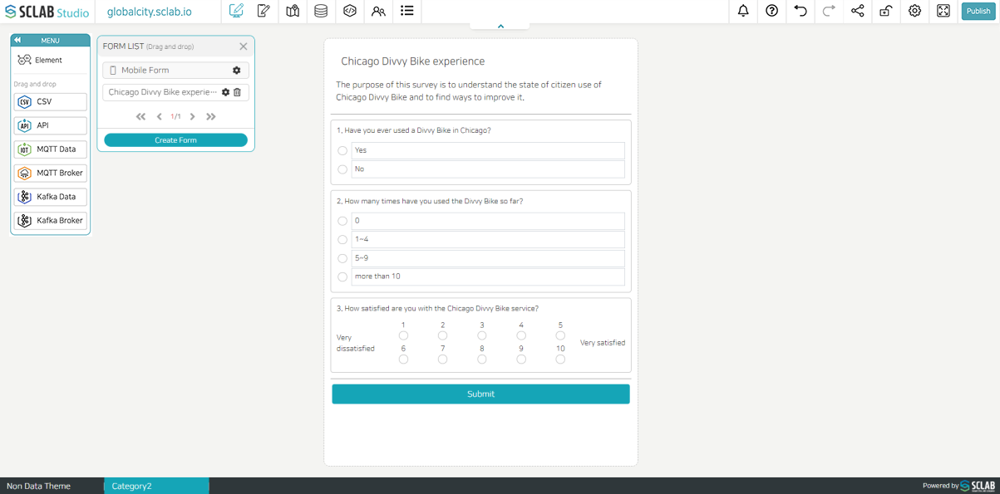
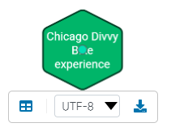

## Mobile Form
-The Mobile Form is provided by default and can be used as a report by posting.The mobile form can only be used on mobile.
-If you click the Setting button on the right of 'Mobile Form', the following pop-upappears.

- Admin Check: If you select 'ON', the administrator can reply after checking the posting.
- Use related post: If you select 'ON', when you create a post on mobile, you can also select other posts you have previously written as related posts.
- Title: You can set a text related to the title of the post. The space under 'Title' is the part that the post writer writes later, and the title of the post is determined. You can add images if you need. 'Title' is not copyable. 'Title' is mandatory, so you cannot choose 'OFF (invisible)' because it must always be visible.
- Content Title: You can set a text related to the contents of the post. The content part under 'Content Title' is the part that the post writer writes later, and details related to the title of the post are written. Images can be added if needed. 'Content Title' cannot be copied. Since 'Content Title' is mandatory, it is always visible, so it is not possible to 'OFF (invisible)',
- Location Title: You can set the location of the post. Under the 'Location Title', the author of the post will select the location from the map and set the location. Images can be added if needed. You can also add an image to use as a pinmark on the map. 'Location Title' cannot be copied. 'Location Title' is mandatory and must always be shown, so it is not possible to select 'OFF (invisible)'.
- Picture Title: You can add images and titles. Invisible can be selected but cannot be copied. You can add various types of labels by clicking the 'Add' button under Picture Title. All of these can be copied, deleted, or made invisible.
- Short Answer Label: Short answer text can be added by the post author below the 'Short Answer Label'.
- Long Sentence Label: Long text can be added by the post author under the 'Long Sentence Label'.
- Category Label: By setting a 'Category Label' the post author can pick and choose one of those categories.
- Link Label: Links can be added by the post author under the 'Link Label'.
- YouTube Link Label: Below the 'YouTube Link Label', the post author can add a YouTube link.
- Date Label: Allows the post author to enter the date associated with the post.
- Time Label: You can have the user input the time related to the post.
- After composing the Mobile Form with the desired contents, click the OK button to save it. In the future, people will log in from mobile and write a post using this form.
  

## Create Form
- If you click the 'Create Form' button in the form list, the following pop-up appears.

- Write the title of the form and write a description related to the form using features such as style, color, font, and alignment. If necessary, it is possible to add a table, image link, or video.
- You can add various types of questions using the 'Add' button below.
- Short Answer: If you want a short answer from the respondent
- Long Sentence: If you want a long answer from the respondent
- Multiple choice questions: Add multiple choice questions
- Check boxes: Add checkbox-type question
- Linear Scale: It is used to ask for answers according to the degree of each step, such as preference.
- Multiple choice Grid: Present your options in a grid pattern. It is useful when the answers to one question are divided into various items.
- Check boxed Grid: It is similar to a multiple-choice grid, except that multiple responses are possible.
- Date, Time: When you want to ask for the date/time
- File Upload: When you want to request a file upload
- After completing the form, click the OK button to add it to the form list.
- Later, if you select it from the form list, drag and drop it in the layout area, and issue it, the form will appear when you access the site. It is saved when you answered the form and press 'Submit'. The administrator can confirm and download it on the data page.
- Let's fill out a survey as a sample using the form.
  

- Press the OK button and save, then set the layout area in the page editor.
- Then, find the survey you just created in the form list and drag and drop it as shown below.
  

- Click the 'Publish' button in the upper right corner.
- If you click the 'nondatatheme1.sclab.io' button in the upper left, a new window will open, and if you access the page in the new window, you can see how the page looks to people.
  

- Select the applicable items and click the 'Submit' button.
- The data that people fill out one by one and click the submit button can be checked on the administrator page.
- You can see that a new green hexagon has been added to the data editor.
  

## Form data check

- If you click the hexagon, it appears like the picture above.
- Click the left window-shaped rectangle to view detailed data.
- You can select the encoding format in the middle and download the data through the download button on the right.
  