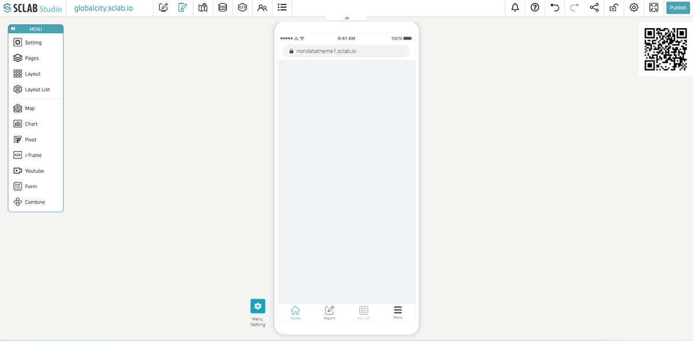
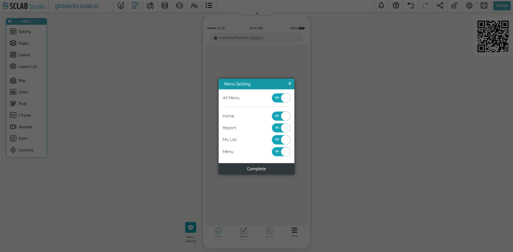
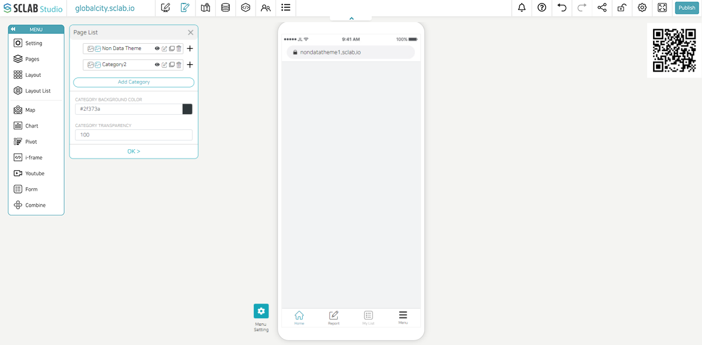
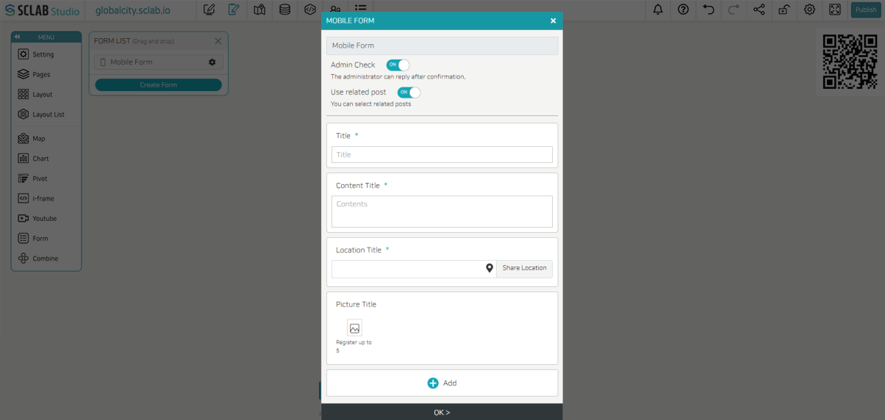

## Mobile editor

- The mobile editor has the same configuration as the page editor used on the web.
- You can configure the content displayed on the mobile web address and the mobile screen.
- You can download the QR on the right and attach it to public places and necessary places to access it on mobile.
  

## Mobile Menu setting

- You can set the menu that appears on the mobile.
- Home: Main page
- Report: If you set this menu as 'ON', you can write a post on mobile.
- My List: You can see the list of posts you have created.
- Menu: If you click this item on mobile, you can see the list of currently configured pages.
  

## Mobile page setting

- If you click the left 'Pages' menu and add a page from the page list, you can add and configure a mobile page.
- When creating a mobile page, if you set the page name to be the same as the page name in the PC editor, you can make the screen displayed on the PC and the screen displayed on the mobile device look different by using a single address depending on the device.
  

## Mobile report

- As explained in the previous 'Form', if you set the mobile post form configuration in the 'Mobile Form' and share it through 'Publish', you can enter the 'Report' menu on the mobile and write a post.
  

- Various digital contents can be utilized, such as reporting on safety facility management, citizens’ reporting on the urban environment, and postings from mobile users.
- Use the QR code on the right side of the mobile editor above to access mobile. Click 'Report' in the menu below and write a post.
- 'Title': Report garbage, 'Content Title': Illegal trash throwing witness. Write it down and click the location icon in the 'Location Title' to select a location, and then click the 'Share Location' button. Add an image from your photo album and click 'Submit'.
  

- If you click the 'Submit' button after writing a post on mobile, the post submitted by the mobile user is exposed in real-time on the web manager screen (photo, title, and content)
- If an 'Admin Check' is checked as 'ON' in 'Mobile Form' when a mobile user submits a post, a new notification will appear on the web post list of the web administrator. If the user clicks the red receive button, a message can be sent to the author, and the status changes to completed when responding. If the manager responds, you can check the manager's response message on mobile.
- Click the eye icon to hide the post on the map or click the pin icon to save the location.
  