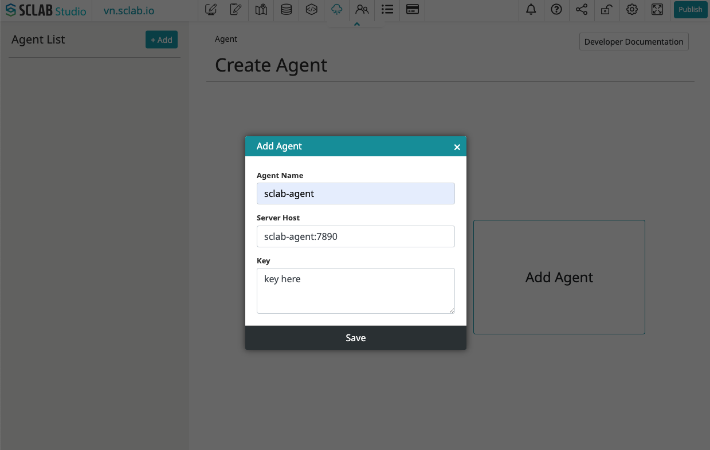

## Introduction
Connect easily to the database using the SCLAB DB Agent.

## Features
- MySQL
- PostgreSQL
- SQL Server
- Oracle
- Altibase
- SAP HANA
- Presto/Trino
- ODBC
- MQTT message publish using SQL Query with interval
- Create REST API endpoint with SQL Query
- JWT for HTTP authorization
- Processing of result data into JSON format
- SQL Injection filter (default on)
- Mapping with Mybatis
- AI SQL query generation
- SQL History view & restore from history

## Installation

### Prerequisites
- Install docker
- Database connection information

### Install SCLAB DB Agent (Skip if using on-premise)
https://hub.docker.com/r/sclabio/sclab-agent

### On Premise 
```bash
# get db agent API token
docker logs sclab-agent
```

### ADD SCLAB DB Agent to your content site


