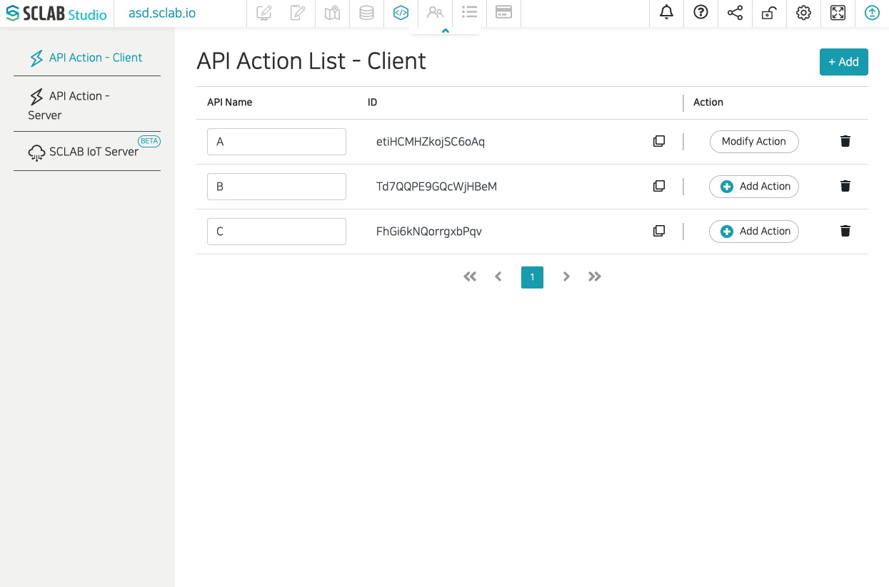
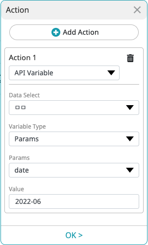

`API Action - Client` 는 스크랩을 iframe 으로 넣어서 사용하거나 사용자의 웹서비스를 스크랩 스튜디오에서 iframe 으로 불러왔을때를 위한 API 입니다.
이것은 웹 브라우져 상에서만 서로 통신을 하기위한 방법입니다.
시작하기 전에 Client API 를 스크랩 스튜디오에서 생성을 미리해주세요.



API Action, API Event는 [window.postMessage()](https://developer.mozilla.org/en-US/docs/Web/API/Window/postMessage) 을 이용하여 구현 되었습니다.

## 액션 실행

스크랩 스튜디오가 부모이고 당신의 웹 서비스가 아이프레임으로 추가된 상태에서, 액션을 실행하는 예제 입니다.

```html
<button onclick="window.parent.postMessage('clientAPIIdHere')">A</button>
```

```javascript
window.parent.postMessage('clientAPIIdHere');
```

:::info
`clientAPIIdHere` 라고 된 부분을 API ID로 변경해주세요. 예) sW47bBZjYyWGjcfaF
:::

## 액션 실행 시 매개변수를 전달하는 방법

"API VARIABLE" 액션을 실행할때 변수의 값을 바꿀 수 있습니다.

| Parameter | Type   | Required | Description   |
|-----------|--------|----------|---------------|
| id        | String | Y        | Client API ID |
| param     | Object | N        | Parameters    |
| header    | Object | N        | Headers       |
| body      | String | N        | body contents |

```javascript
window.parent.postMessage({
    id: 'clientAPIIdHere',
    param: {
        key: "value"
    },
    header: {
        myHeaderKy: "myValue"
    },
    body: JSON.stringify({key: "value"})
});
```


위 스크린샷과 같이 params 의 date 값을 변경하고 싶으면 아래와 같이 실행하면 됩니다.
```javascript
window.parent.postMessage({
    id: 'clientAPIIdHere',
    param: {
        date: "2022-05"
    }
});
```

## API 이벤트

스크랩에서 iframe 으로 메시지를 전송할때는 액션에서 "API Event" 를 이용하시면 됩니다. 레이아웃이나 지도등에서 액션을 설정할 수 있습니다.


```javascript
window.addEventListener("message", (event)=>{
  if(event.origin !== 'https://yoursitecode.sclab.io'){
    return;
  }
  if(event.data === "MY_DATA") {
    console.log('data received');
  }
});
```

```html
<script>
  window.addEventListener("message", (event)=>{
    if(event.origin !== 'https://yoursitecode.sclab.io'){
      return;
    }
    
    if(event.data === "MY_DATA") {
      document.getElementById("msg").innerHTML = "clicked";
    }
  });
</script>
<div id="msg">
  HI
</div>
```