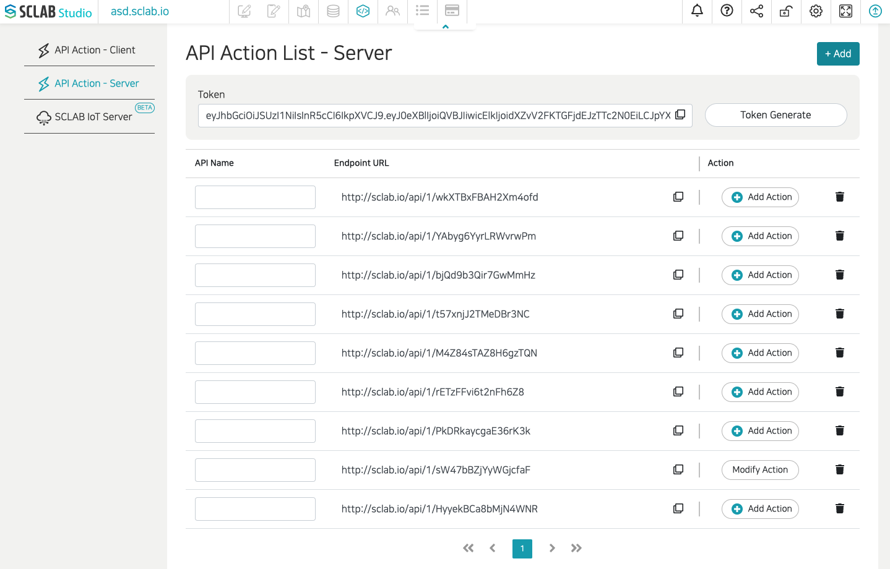

SCLAB uses API JWT to allow access to the API. You can register a new SCLAB API key at our [SCLAB Studio](https://app.sclab.io).

SCLAB expects for the API token to be included in all API requests to the server in a header that looks like the following:

Authorization: APITokenHere

And also you can use query string or JSON key and value for POST request.

```shell
# authorization header 
curl "api_endpoint_here" \
  -H "Authorization: APITokenHere"

# query string for without header
curl "api_endpoint_here?token=APITokenHere"

# json body for POST
curl "api_endpoint_here" \
  -H "Content-Type: application/json" \
  -X POST \
  -d "{\"token\": \"APITokenHere\"}"
```

:::warning

Remember to replace `APITokenHere` with your personal API token and ensure that you do not share it publicly.
Please regenerate your API key if you have lost it or it has been compromised.

:::

