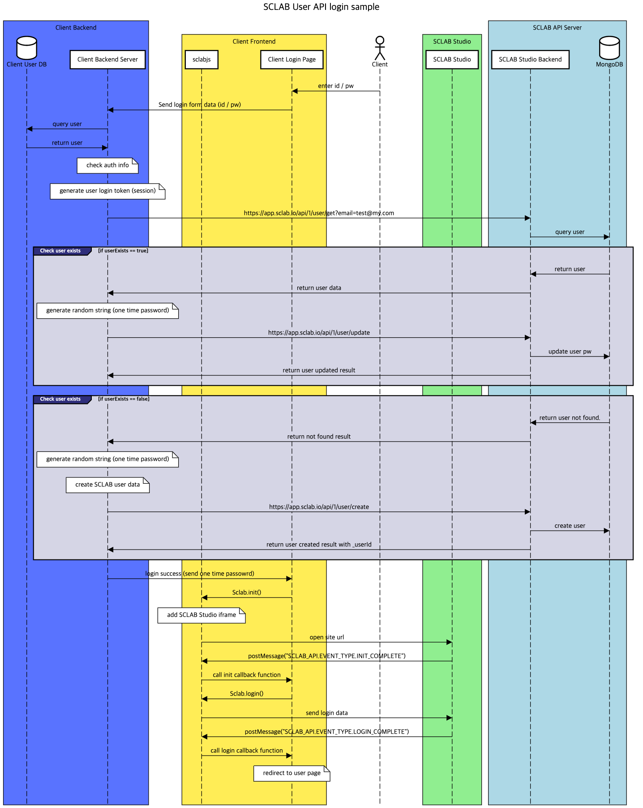

API로 생성된 계정만 API로 관리가 가능합니다.

## 회원정보 가져오기

```shell
curl "https://app.sclab.io/api/1/user/get?_userId=jJpp2WfD7yp7y2cEk" \
  -H "Authorization: APITokenHere" \
  -H "Content-Type: application/json"

or
  
curl "https://app.sclab.io/api/1/user/get?email=test@sclab.io" \
  -H "Authorization: APITokenHere" \
  -H "Content-Type: application/json"
```

> 위 명령을 실행하면 아래의 JSON 응답을 반환 합니다.:

```json
{
  "result": {
    "_userId": "jJpp2WfD7yp7y2cEk",
    "email": "test@sclab.io",
    "name": "tester",
    "phone": "01012341234",
    "address": "seoul"
  }
}
```

이 엔드포인트는 회원정보를 가져옵니다.

### HTTP Request

`GET https://app.sclab.io/api/1/user/get`

### JSON Parameters

Parameter | Required | Description
-- | -- | -- |
_userId | N | User id
email | N | Email

## 신규 회원 생성

```shell
curl "https://app.sclab.io/api/1/user/create" \
  -X POST \
  -H "Authorization: APITokenHere" \
  -H "Content-Type: application/json" \
  -d "{\"email\": \"email@address.com\", \"password\": \"password string\", \"name\": \"user name\"}"
```

> 위 명령을 실행하면 아래의 JSON 응답을 반환 합니다.:

```json
{
  "result": {
    "_userId": "aspfokgwegoepwk",
    "status": "user created"
  }
}
```

이 엔드포인트는 사이트의 회원을 생성합니다.

### HTTP Request

`POST https://app.sclab.io/api/1/user/create`

### JSON Parameters

Parameter | Required | Description 
-- | -- | -- | 
email | Y | User email address
password | Y | User password
name | Y | User's name
phone | N | User phone number
address | N | User address

## 회원정보 수정

```shell
curl "https://app.sclab.io/api/1/user/update" \
  -X POST \
  -H "Authorization: APITokenHere" \
  -H "Content-Type: application/json" \
  -d "{\"_userId\": \"userid\", \"name\": \"user name\"}"
```

> 위 명령을 실행하면 아래의 JSON 응답을 반환 합니다.:

```json
{
  "result": {
    "status": "user updated"
  }
}
```

이 엔드포인트는 사이트 회원정보를 업데이트 합니다. [name, phone, address, password].

### HTTP Request

`POST https://app.sclab.io/api/1/user/update`

### JSON Parameters

Parameter | Required | Description
-- | -- | -- |
_userId | Y | User id
name | N | User's name
phone | N | User phone number
address | N | User address
password | N | User's password


## 회원 삭제

```shell
curl "https://app.sclab.io/api/1/user/delete" \
  -X DELETE \
  -H "Authorization: APITokenHere" \
  -H "Content-Type: application/json" \
  -d "{\"_userId\": \"user id\"}"
```

> 위 명령을 실행하면 아래의 JSON 응답을 반환 합니다.:

```json
{
  "result": {
    "status": "user removed"
  }
}
```

이 엔드포인트는 사이트 회원을 삭제합니다.

### HTTP Request

`DELETE https://app.sclab.io/api/1/user/delete`

### JSON Parameters

Parameter | Required | Description
-- | -- | -- |
_userId | Y | User id

## SCLAB User API 로그인 샘플 프로
