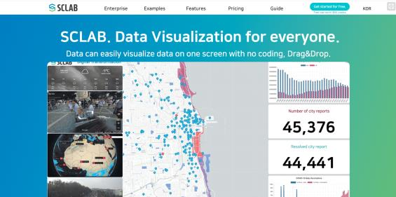
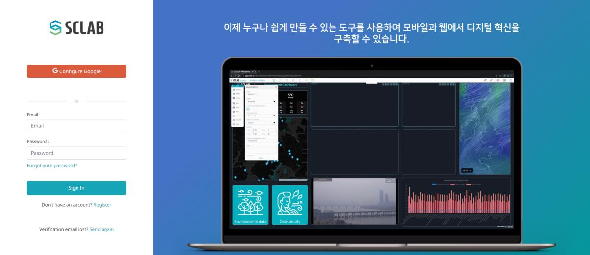
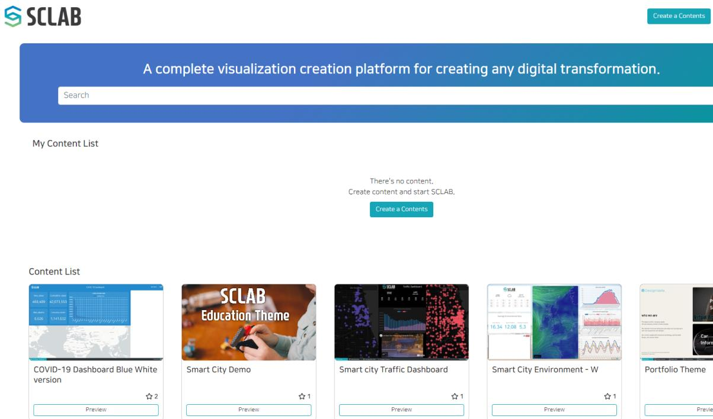
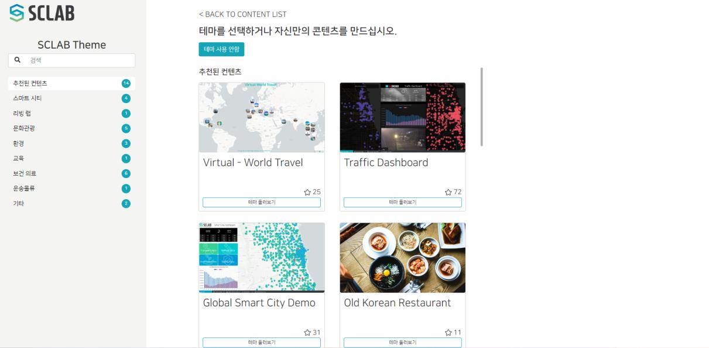
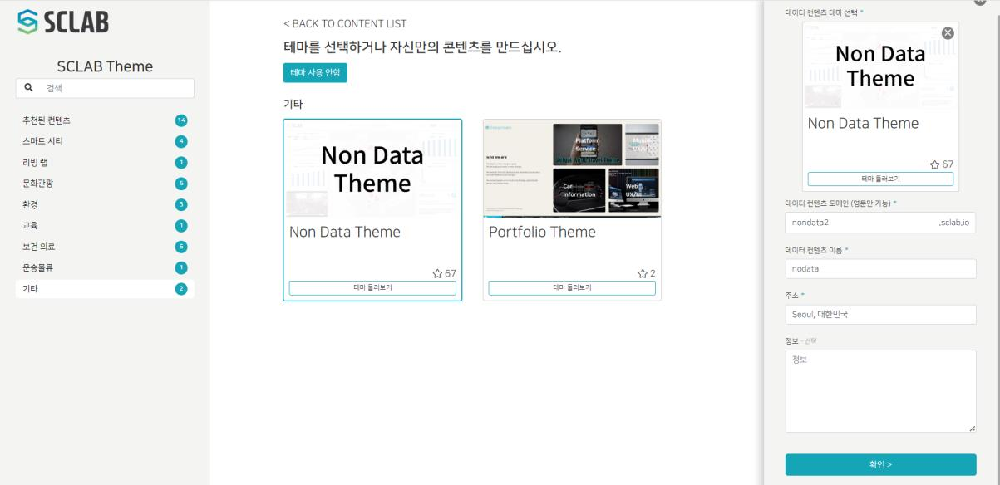
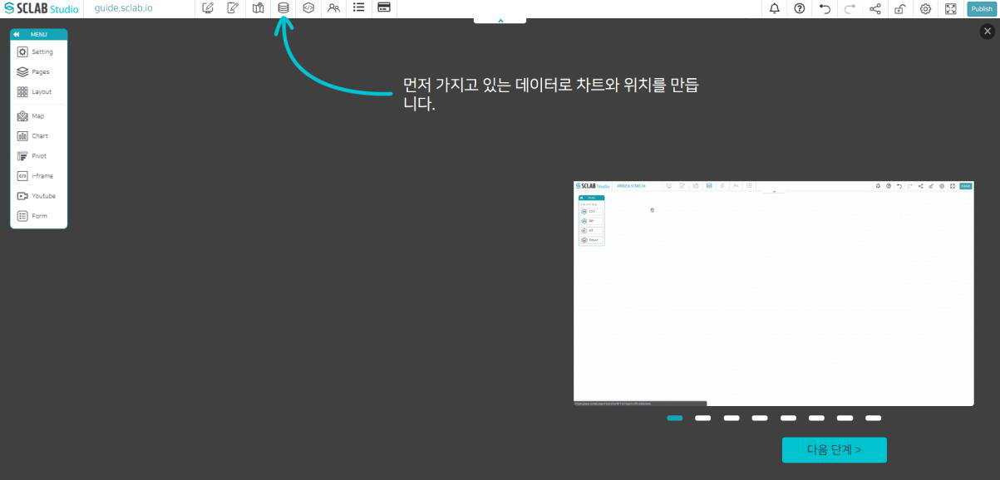
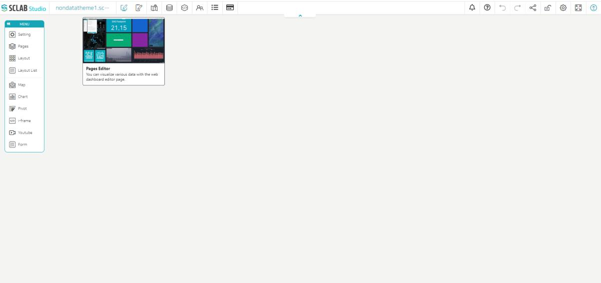
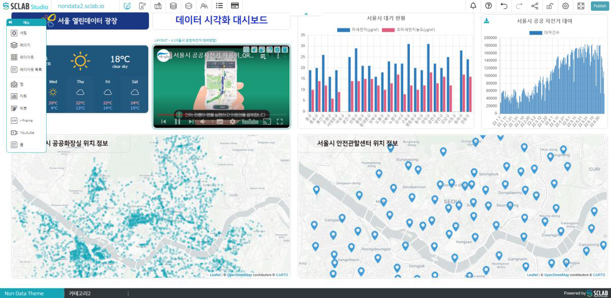

https://www.sclab.io/p/SCLAB_KOR 
스크랩 홈페이지 주소로 접속한다.

 
SCLAB에 로그인하거나 계정을 생성하려면 홈페이지 또는 다양한 콘텐츠 페이지의 오른쪽 상단에 있는 '지금 시작하세요!' 또는 '로그인' 버튼을 클릭해 준다.
  

## 로그인

로그인 계정이 없는 경우 로그인 버튼 아래 ‘Register’을 클릭하면 회원 가입화면으로 이동한다.
  

이메일 계정과 비밀번호를 입력하여 SCLAB 계정을 생성할 수 있으며 Google 계정을 사용할 수도 있다. 하단에 Privacy Policy(개인정보 보호정책) 및 Terms of Use(이용 약관)을 체크하고 ‘Register Now’를 클릭한 후 등록한 이메일 주소로 들어가 이메일을 확인해 주면 가입이 완료된다.
  

로그인 후 나의 콘텐츠 목록 또는 페이지 우측 상단에 있는 ‘컨텐츠 사이트 생성’ 버튼을 클릭하면 데이터 컨텐츠 사이트를 생성하는 페이지로 이동한다.
  

## 시각화 만들기

원하는 테마의 카테고리를 선택하면 중앙에 테마 리스트가 나타나며 테마 하단에 '테마 둘러보기’ 버튼을 클릭 시 새 탭으로 해당 테마 사이트가 열리고 테마 구성을 확인해 볼 수 있다.
  

테마를 선택하면 오른쪽에 컨텐츠 정보를 입력할 수 있는 창이 나타나며 정보를 입력하고 하단에 '확인' 버튼을 클릭하면 데이터 컨텐츠를 에디터 할 수 있는 SCLAB Studio가 시작된다.
데이터 콘텐츠 도메인은 띄어쓰기 없이 영문만 입력 가능하다. 도메인은 한번 설정하면 수정이 불가능하므로 신중히 설정하자. 여기서는 Non Data Theme을 선택해 보자.
  

SCLAB Studio의 첫 화면은 튜토리얼로 기본 기능 튜토리얼이 시작된다.
다시 튜토리얼을 배우고 싶다면 오른쪽 상단에 '?'아이콘을 클릭하면 튜토리얼이 다시 시작된다.
  

SCLAB Studio에서는 사용자들이 알기 쉽도록 각각의 메뉴들을 마우스 오버 시 툴팁이 노출된다.
  

## 제작한 시각화 배포하기

- 기존에 레이아웃 구성을 설정했는데 원하는 레이아웃 위치에 원하는 종류의 맵, 차트, iframe, Youtube, 웹페이지 등의 데이터를 드래그 앤 드롭으로 가져다 놓는다.
- 구성이 완료되면 TOP 메뉴 가장 오른쪽에 있는 발행하기 버튼을 클릭하여 다른 사람들과 공유할 수 있도록 해 준다. 추후에 수정하거나 할 경우 다시 발행하기 버튼을 눌러야 다른 사람들이 수정된 화면을 볼 수 있다.
  

https://app.sclab.io/ 
