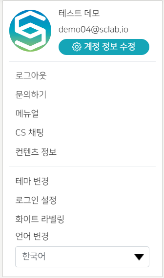

- 설정 메뉴는 화면 오른쪽 상단 톱니바퀴 모양 아이콘을 클릭하면 된다.
- 설정 상단에는 사용자의 썸네일 이미지, 사용자 이름 및 이메일 정보가 표시된다.
- 계정 정보 수정: 계정 이름, 썸네일 추가, 비밀번호 변경, 계정 삭제를 요청할 수 있다.
- 문의하기: 이메일로 문의할 수 있다.
- 매뉴얼: 새 창이 열리고 스크랩 프로그램 사용 관련 매뉴얼을 볼 수 있다.
- CS채팅: SCLAB CS 관리자에게 채팅으로 문의할 수 있다.
- 컨텐츠 정보: 클릭하면 해당 컨텐츠 정보가 팝업으로 뜬다. 이미지를 업로드 하면 웹이나 모바일에서 나타나는 컨텐츠 대표 이미지가 수정된다. 컨텐츠 타이틀 및 정보도 수정 가능하다. 적용된 테마도 변경 가능하지만 테마를 변경하면 현재 데이터가 모두 삭제된다. 컨텐츠 삭제 요청 시 해당 데이터가 영구 삭제된다.
- 테마변경: 여기서도 컨텐츠 테마 변경이 가능하다.
- 로그인 설정: 카카오/구글/아이디로 로그인 방법을 설정할 수 있다.
- 화이트라벨링: 로고, 파비콘, 도메인(도메인 변경은 관리자에게 문의) 등을 변경
- 언어변경: 한국어, Español, हिन्दी, English, Português로 선택
  