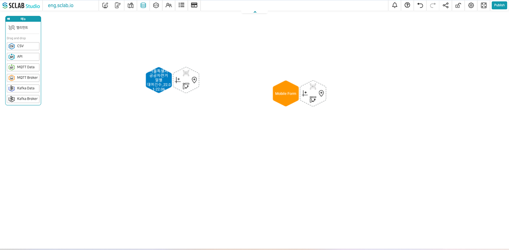
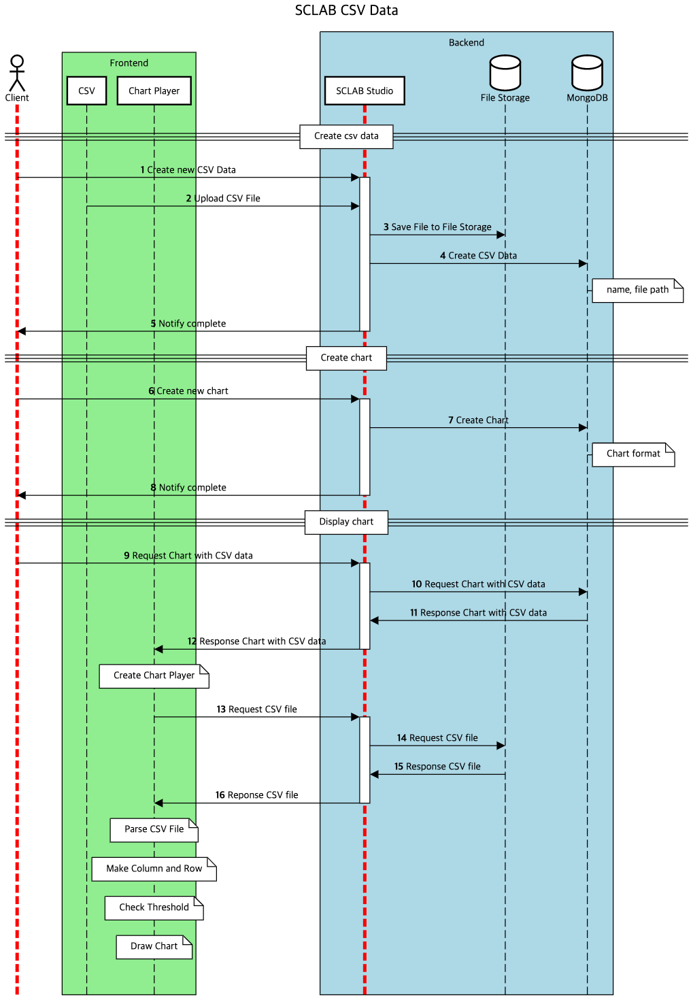

- CSV 아이콘을 드래그 앤 드롭하여 끌고 오면 파일을 열 수 있는 화면이 뜬다.
- 이전에 컴퓨터에 저장된 파일을 불러오거나 아니면 시민에게 개방된 공공 데이터를 다운받아 불러와도 좋다. (ex) 서울시의 서울 열린데이터 광장)
 

 
- 파일을 불러오면 육각형 모양의 아이콘이 생긴다. 왼쪽 육각형에는 해당 파일 명이 뜨고 오른쪽 육각형은 위치, 차트, 피벗 등을 만들 수 있는 도구 모음이다. 왼쪽 육각형의 중앙을 클릭하면 중앙에 녹색 동그라미가 나타나는데 이를 클릭하여 드래그 하면 해당 아이콘의 위치를 옮길 수 있다.
  

- 왼쪽 육각형을 클릭하면 네 개의 아이콘이 뜨는데 첫 아이콘은 제목 수정, 둘째는 삭제, 셋째는 파일 다운로드 버튼, 넷째는 재 업로드 버튼이다.
  

## CSV Data Flow
