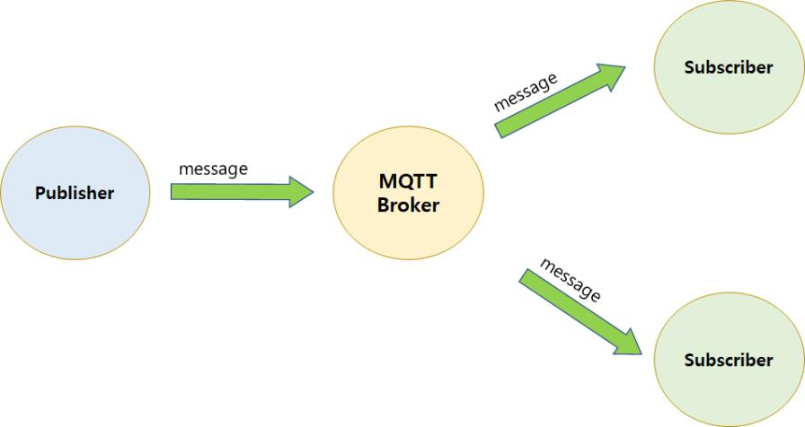
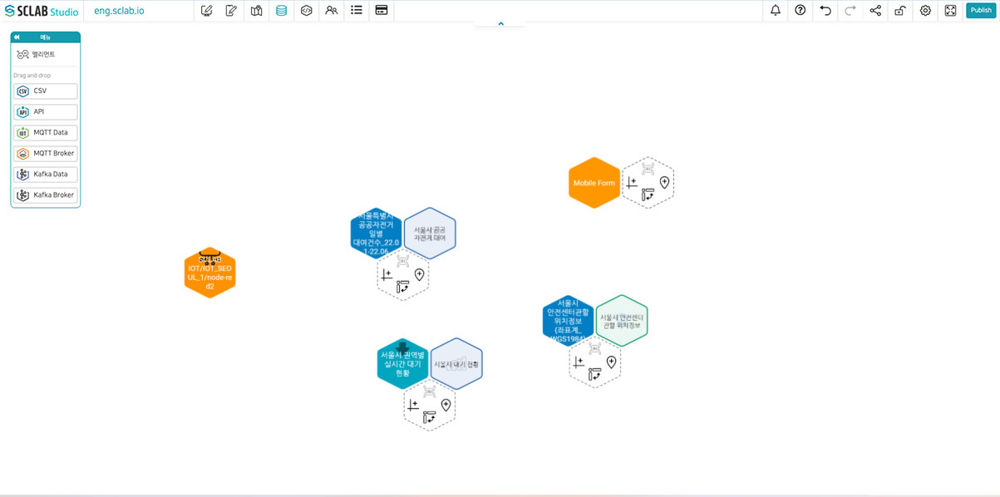
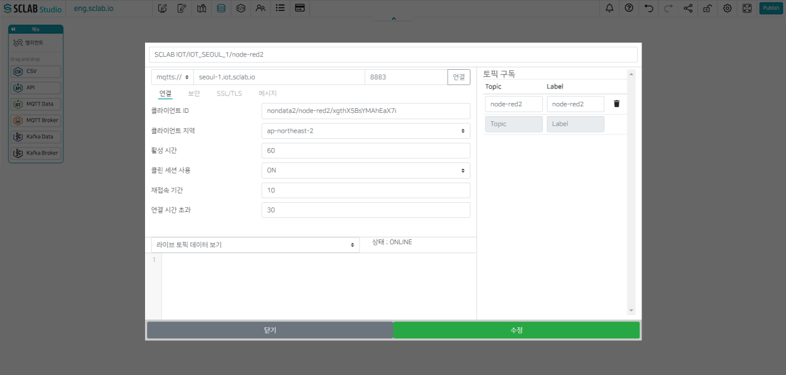

## IoT
- IoT 데이터를 수집하기 위해 MQTT 프로토콜 방식을 사용한다.
- MQTT 프로토콜에서는 Publisher(출력값을 제공)와 Subscriber(받아서 쓰는 구독자)가 특정 Topic에 관한 메시지를 Broker(서버)를 통해 주고받을 수 있다.

- Broker 주소(IoT 서버 주소)를 알아 양쪽에서 다 접속해야 메시지를 보내고 수신 가능하다.
- 외부 IoT 서버 주소가 있다면 사용해도 좋다. 없으면 SCLAB IoT 서버를 이용할 수 있다. SCLAB Studio 개발 편집기 페이지에서 SCLAB IoT 서버를 이용한 Broker 생성 및 토픽 생성이 가능하다.
- 개발 편집기 페이지 메뉴를 열고 왼쪽의 SCLAB IoT Server를 클릭한다.
- 토픽을 입력하고 토픽 생성 버튼을 누르면 아래와 같이 IoT 서버 관련 정보가 생성됨을 알 수 있다.
  

- 데이터 편집기로 들어가보면 주황색 IoT 서버 아이콘이 생성된 것을 볼 수 있다.
- 데이터 편집기에서도 IoT 서버 설정이 가능하다. 아래서 간략히 설명하겠다.
  

## IoT 서버 세팅

- 데이터 편집기에서 주황색 육각형 Server 라고 되어 있는 아이콘을 끌어다 놓으면 위와 같은 팝업이 뜬다.
- mqtts://, mqtt://, 확인 후 IoT 주소와 Port와 IoT 서버 이름과 클라이언트 ID 입력
- Topic 및 Label 도 입력한다.
- 보안 탭에서 유저이름, 비밀번호를 입력. SSL/TLS, 메시지도 수정 가능하다.
- 연결 클릭 후 하단에 상태: ONLINE 확인
- 라이브 토픽 데이터 보기 하단에서 선택하면 해당 항목의 실시간 데이터를 볼 수 있다.
- 하단에 초록색 저장 버튼 클릭 시 데이터 화면에 IoT Server 육각형이 생성된다. IoT 서버가 설정된 것이다.
  

## IoT 데이터 세팅

- 데이터 편집기에서 IoT 아이콘을 끌어다 놓으면 위와 같은 팝업이 뜬다.
- IoT 데이터 이름을 입력하고 IoT 서버를 선택하고 Topic을 선택한다. 스택 크기 입력 후 연결 버튼 클릭하면 실시간 데이터를 확인할 수 있다. 스택 크기는 데이터의 실시간 노출 수를 말한다.
- Root path 밑에 A모양 버튼을 클릭하면 Path와 Label이 나타난다.
- 하단에 저장버튼을 클릭하면 데이터 화면에 연두색 IoT 데이터 육각형이 생성된다.
  

  

<iframe width="100%" height="640" src="https://www.youtube.com/embed/peMHHOM_078" title="YouTube video player" frameborder="0" allow="accelerometer; autoplay; clipboard-write; encrypted-media; gyroscope; picture-in-picture; web-share" allowfullscreen></iframe>

  