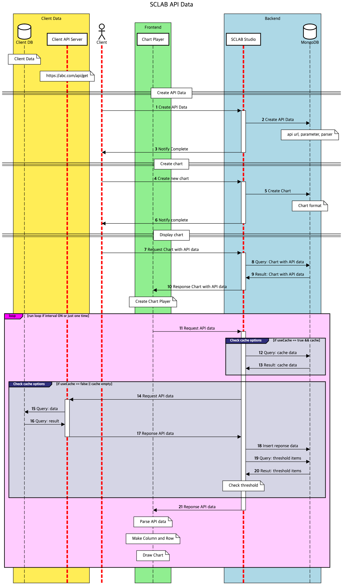

- API 아이콘을 드래그 앤 드롭하여 끌고 오면 위처럼 팝업창이 뜬다.
- API 이름을 입력하고 GET 옆에 API 주소를 입력하고 전송을 클릭한다.
- 아래 Pretty 쪽에 상세 데이터가 뜬다.
- 오른쪽에 원하는 데이터 종류가 뜨지 않는다면 Pretty 아래에서 원하는 데이터의 Root와 Path를 찾아서 입력한 뒤 A모양 버튼을 클릭한다. Pretty 아래 왼쪽 숫자옆 화살표 버튼을 클릭해 보고 원하는 데이터가 들어 있는 상위의 Root명을 찾아 준다. 위 데이터에선 “RealtimeCityAir” 아래 모든 데이터가 들어 있음을 알 수 있다. 그리고 “row” 안에 필요한 상세 데이터가 있음을 확인한다. 오른쪽 Root Path 칸에 “RealtimeCityAir.row”를 입력해 준다. 오른쪽 A모양 버튼을 클릭하면 데이터 Path 와 Label이 추가로 들어오는 것을 확인 가능하다.
- 분단위로 폴링 주기를 선택할 수 있다. 폴링 안함은 데이터를 한 번만 가져오는 것이다.
- API 이름을 입력해 주고 저장을 누르면 API 데이터가 생성되어 청록색 육각형이 하나 더 생긴 것을 알 수 있다.
  

## 변수 형식
- "FIEXED"는 값이 변경되지 않고, API를 호출할때 서버단에서 사용되고 클라이언트 단에서는 해당 값들을 확인 할 수 없기 때문에 키값과 같이 보안이슈가 있을 수 있는 값들에 사용하면 됩니다.
- "Variable"은 변수 형식의 데이터로 액션 기능을 이용하여 값을 변경 시킬 수 있습니다.
- "Current Location"은 현재의 위치 값입니다.
- "Map Location"은 지도의 가운데 좌표를 가져와서 데이터를 불러올 수 있습니다.
- "Date"는 날짜 형식의 값으로 값을 만들어 낼 수 있습니다.

### 날짜 포맷
- 날짜는 포맷은 yyyy-MM 과 같이 그냥 데이트 형식을 지정하면 해당 날짜로 치환되어 API를 호출 합니다.
- JSON 형식으로 보다 다양한 날짜 형식을 만들어 낼 수 있습니다.

~~~json
{
  "format": "yyyy-MM",
  "add": {
    "days": 1
  },
  "startOf": "day"
}
~~~

| 키 | 포멧 | 설명                                  |
|--- | --- |-------------------------------------|
| format | String | {"format": "YYYY-MM-DD"} 날짜 포맷      |
| add | Object | {"days": -1} -> 어제                  |
| startOf | String | {"startOf": "month"} -> 해당 월의 시작 시점 |
| endOf | String | {"endOf": "month"} -> 해당 월의 종료 시점   |
| utc | Boolean | UTC 사용 여부                           |

<iframe width="100%" height="640" src="https://www.youtube.com/embed/ZTcO_Gdhtmk" title="YouTube video player" frameborder="0" allow="accelerometer; autoplay; clipboard-write; encrypted-media; gyroscope; picture-in-picture; web-share" allowfullscreen></iframe>

  

## API Data Flow
