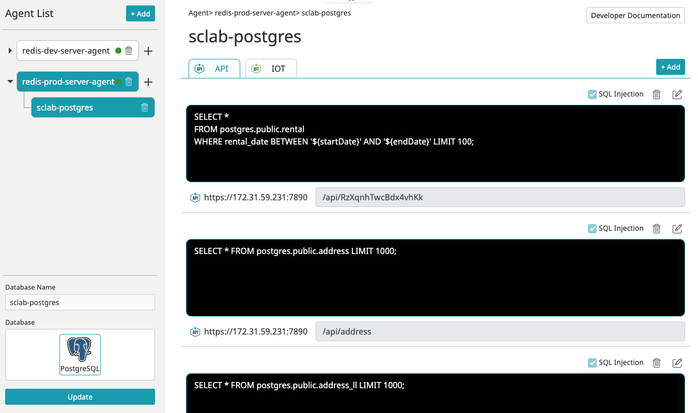
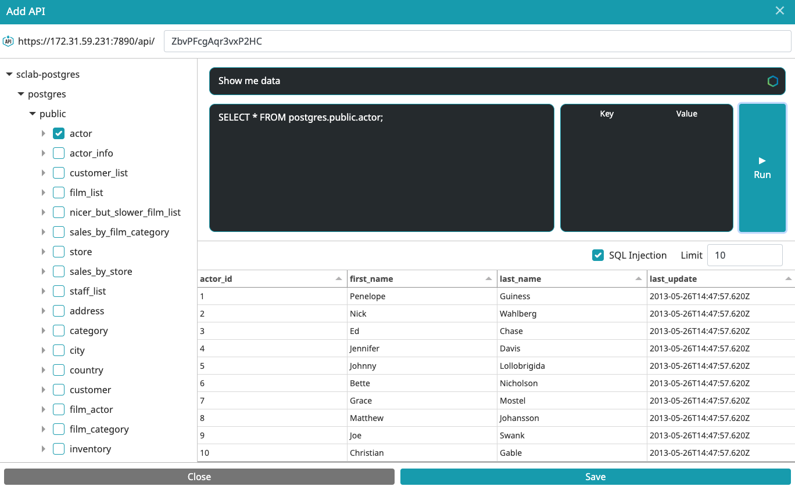
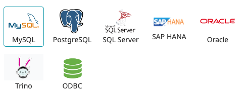
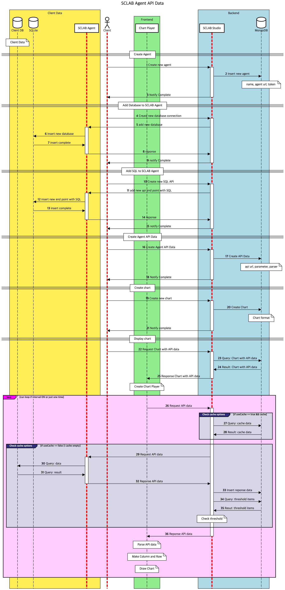

## 기능

- 고객의 데이터 베이스에 SQL 쿼리를 이용해서 스크랩으로 데이터를 가져올 수 있습니다.
- AI를 통해 SQL을 잘 모르더라도 쉽게 이용 가능합니다.
- MySQL, Postgres, SQL Server, SAP HANA, ORACLE, Trino, ODBC 등 다양한 데이터 소스에 접속할 수 있습니다.

- MQTT 프로토콜을 이용해 주기적으로 SQL을 실행하고 데이터를 가지고 올 수 있습니다.
- HTTPS 프로토콜을 이용해 통신하기 때문에 안전합니다.
- 소스코드가 공개 되어있어 직접 커스터마이징이 가능합니다.
- [https://github.com/sclab-io/sclab-agent](https://github.com/sclab-io/sclab-agent)

## Agent 설치

- Docker를 이용해서 손쉽게 설치할 수 있습니다.
- [https://hub.docker.com/r/sclabio/sclab-agent](https://hub.docker.com/r/sclabio/sclab-agent)

## SCLAB Agent Data Flow

