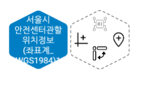
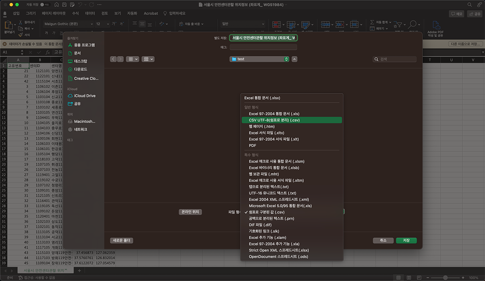
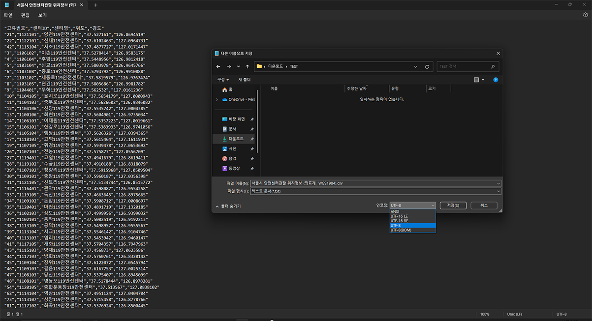

- CSV 아이콘을 끌어와서 서울시안전센터관할 위치정보 CSV 파일을 불러온다.
- 생성된 CSV 육각형에서 우선 오른쪽 육각형의 뒤집힌 물방울 모양 아이콘을 클릭하여 위치 데이터를 만들어 보자.

- 위치 아이콘을 업로드 버튼을 눌러 새로 추가하거나 아이콘 목록에 있는 위치 아이콘 하나를 선택하고 다음 단계로 넘어간다.
  

- 위, 경도 선택 및 툴팁정보, 툴팁컬러를 선택하고 다음 단계 클릭, 위치 이름을 입력 후 저장해 주면 위치 데이터가 생성된다. 아래를 보면 연한 녹색 육각형이 추가된 것을 볼 수 있다.
  

- CSV 파일에서 한글이 깨지는 파일인 경우 엑셀이나 메모장 등에서 UTF-8로 저장하시면 한글이 정상적으로 나오게 된다.
  

  