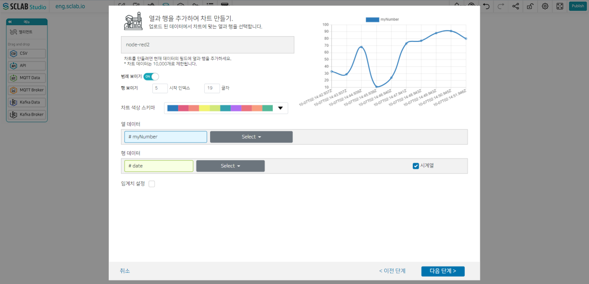

- 방금 생성된 연두색 육각형 아이콘 오른쪽 차트 아이콘을 선택한다.
- 차트 종류 중에 꺾은선 차트(Line chart(white version)를 선택하고 다음 단계를 클릭한다.
- IoT 차트는 실시간 차트가 가능하다. 시계열을 체크하면 레이아웃에 해당 차트 드롭 시 아래와 같이 LIVE 표시와 함께 시간/날짜 간격으로 검색할 수 있다.
  

- 임계치를 설정할 데이터와 임계치 이름, 값, 색상을 설정한다.
- 다음 단계 클릭, 차트 확인 후 저장 버튼을 클릭한다.
- 연두색 IoT 육각형 아이콘 오른쪽에 차트 아이콘이 하나 더 생성된 것을 볼 수 있다.

  