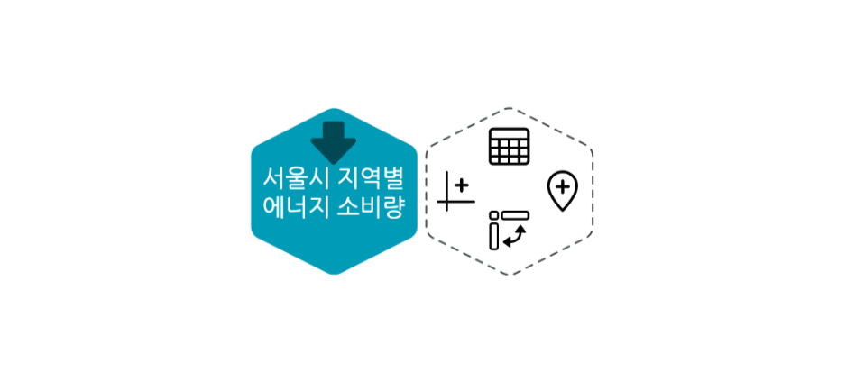
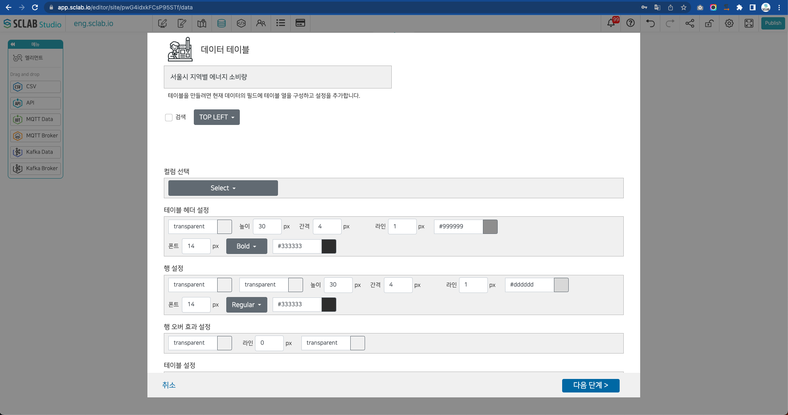
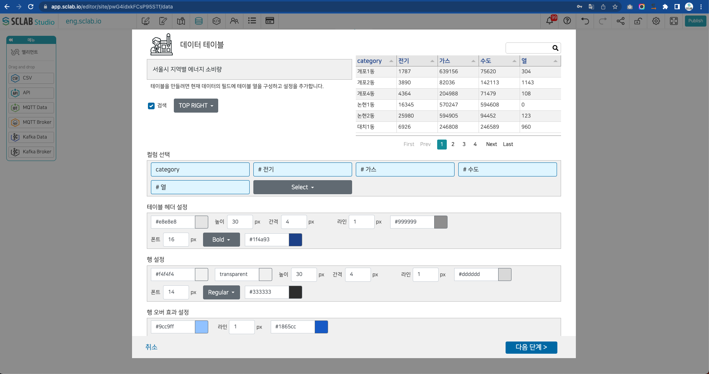

- API, IoT, CSV 파일을 불러온다.
- 생성된 육각형에서 상단에 테이블 아이콘을 클릭하여 데이터 테이블을 만들어 보자.
  

- API, IoT, CSV 데이터를 테이블 방식으로 시각화 하기 위해서 컬럼선택, 테이블 헤더, 행, 행 오버 효과, 테이블 테두리, 페이징, 임계치를 설정한다. 
  

- 검색: 데이터 테이블의 데이터를 검색 버튼의 기능 노출 여부와 검색노출 위치를 설정한다.
- 컬럼 선택: 선택 순서에 따라서 왼쪽에서 오른쪽으로 테이블이 생성된다.
- 테이블 헤더 설정: 테이블 헤더의 배경컬러, 높이, 간격, 라인의 두께와 컬러, 폰트의 크기와 스타일 및 컬러를 설정한다. 
- 행 설정: 행의 짝수 행(even), 홀수 행(odd) 배경컬러, 높이, 간격, 라인의 두께와 컬러, 폰트의 크기와 스타일 및 컬러를 설정한다.
- 행 오버 효과 설정: 마우스 오버 시 행의 컬러, 테두리 두께와 컬러를 설정한다.
  

- 테이블 테두리 설정: 테이블의 테두리 두께와 컬러를 설정한다.
- 페이징: 페이지를 스크롤과 페이징으로 설정할 수 있으며 하단의 페이징을 5, 7, 10의 버튼에서 선택하여 설정한다.
- 임계치 설정: 임계치 설정은 다른 차트들과 동일하며 알람 및 액션을 적용할 수 있다.
  

- 데이터 테이블에 나타나는 데이터 행 수는 레이아웃에 따라서 달라진다.
- 설정한 데이터 테이블을 미리보기 확인 후 테이블의 이름을 입력하고 저장합니다. 
  

- 육각형 아이콘 오른쪽에 차트 아이콘이 생성된 것을 볼 수 있다.

  