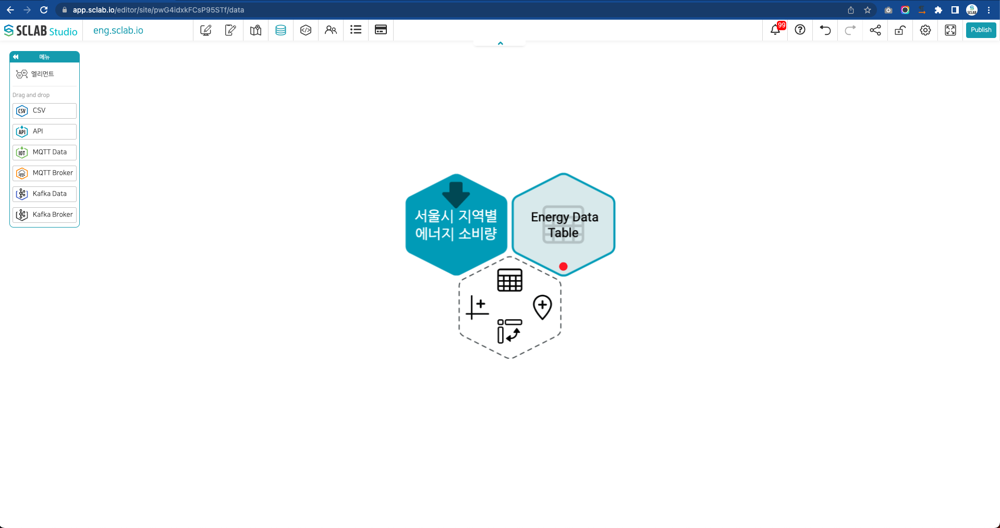
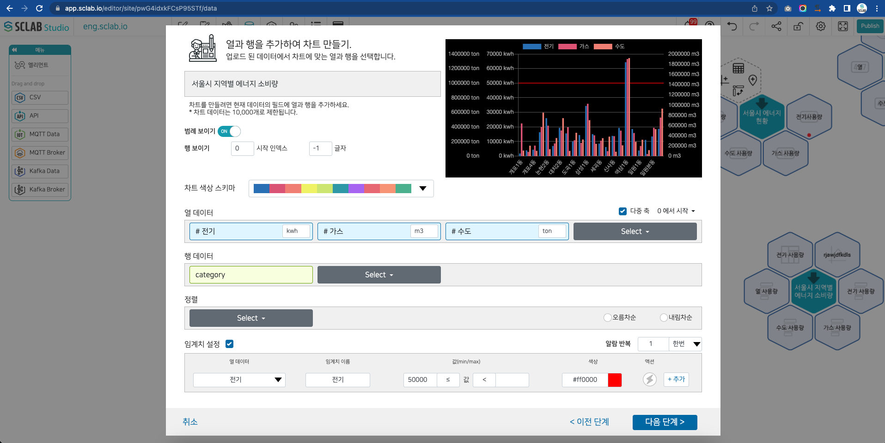
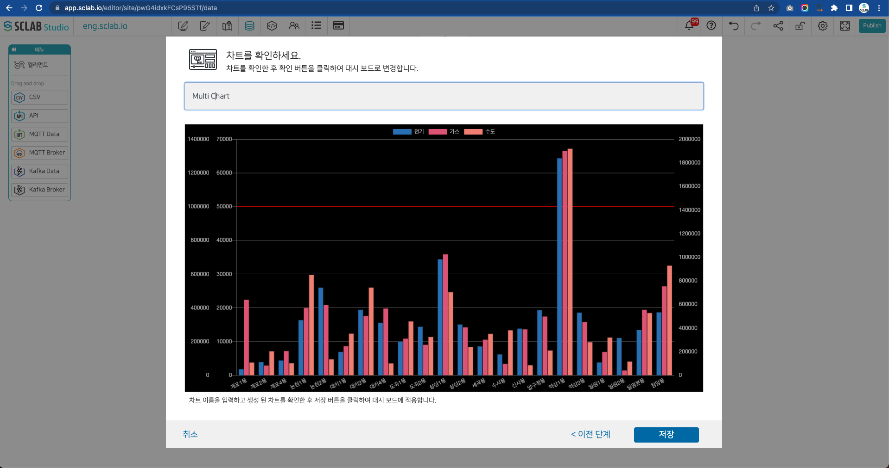

- API, IoT, CSV 파일들의 육각형 아이콘 오른쪽 육각형 아이콘에서 왼쪽 차트 모양 클릭한다.
  

- 생성하고자 하는 차트 종류를 선택하고 다음 단계를 클릭한다. 여기서는 Bar Char를 선택한다.
  

- 차트의 범례 노출여부를 선택한다.
- 행에 보이는 글자 시작점과 총 글자 수를 조절할 수 있다.
- 차트 색상 스키마에서 차트 색깔 조합을 선택한다.
- 열 데이터 오른쪽 상단에 다중 축을 체크하면 하단의 열 데이터 방식이 다중 열 데이터 방식설정 방식으로 변한다.
- 열 데이터에서 데이터를 선택 후 단위를 입력하면 다중 열 데이터에 단위가 나타난다.
- 열 데이터 오른쪽 상단에 차트 0으로 기준을 하고자 하는 데이터를 선택하면 차트의 기준이 설정된다.
- 행 데이터 선택한다.
- 필요시 데이터를 오름차순, 내림차순으로 정리하거나 임계치를 설정할 수도 있다. 임계치를 설정할 데이터와 임계치 이름, 값, 색상을 설정한다.
  

- 차트를 확인 후 차트 이름을 입력해 주고 저장버튼을 클릭한다.
  

- 육각형 아이콘 오른쪽에 차트 아이콘이 생성된 것을 볼 수 있다.

  