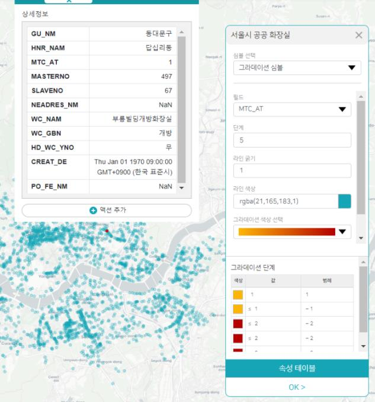

- 맵 편집기에서 웹 맵 추가하고 타이틀을 수정한 뒤 오른쪽 수정 버튼을 클릭하자
- 맵 항목을 클릭하고 원하는 배경의 맵을 고르자. 서울시 공공화장실 위치 정보이니 확대하여 서울시가 보이도록 한 후 현재 위치를 저장한다.
- GIS 데이터 생성 버튼을 클릭하여 저장된 GIS 데이터를 불러온다.
- 위에서 활성화했던 위치 데이터를 비활성화 해주면 아래와 같이 나타난다.
  

- 다시 맵 메뉴로 돌아가서 현재 위치를 저장해 준다.
- 맵 편집기로 돌아가서 확인해 보면 마지막에 저장한 모습으로 적용된 것을 알 수 있다.
- GIS 데이터 또한 마찬가지로 위치 중에 한 곳을 클릭하면 해당 위치에 관한 상세 정보가 뜨고 이 위치에 액션을 추가할 수 있다.
- GIS 데이터 목록에는 추가적으로 해당 심볼에 그라데이션을 추가할 수 있다.
  

- 심볼 선택에서 그라데이션 심볼을 선택하면 된다. 그라데이션 단계 및 색상 종류도 선택 가능하다. 싱글 심볼도 색상 및 라인 굵기 등 설정 가능하다.
  