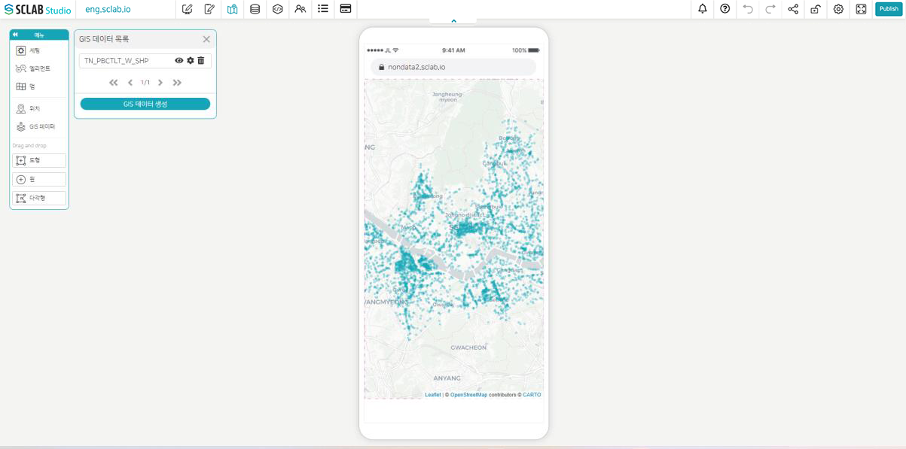
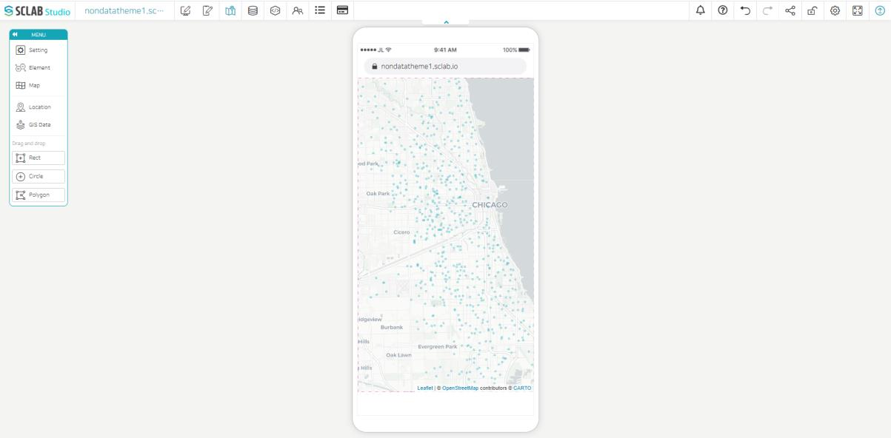

- 모바일 맵도 같은 원리로 맵을 제작할 수 있다. 모바일에서 확인할 수 있는 화면이라는 것만 차이가 있다.
- 편집기에서 모바일 맵 추가하기를 클릭, 제목을 설정해 주고 수정 버튼을 클릭한다.
  

- 맵메뉴에서 원하는 맵을 선택해 주고 GIS 데이터를 생성한 뒤 맵 위에 데이터를 추가해 준다. 알맞게 확대나 축소를 해준 뒤 다시 맵 메뉴로 돌아가서 현재 위치를 저장해 준다.
- 맵 편집기로 돌아가서 확인해 보면 마지막에 저장한 모습으로 적용된 것을 알 수 있다.
  