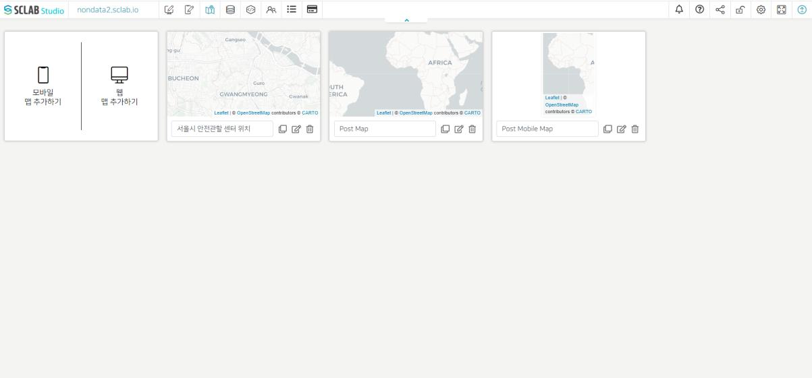
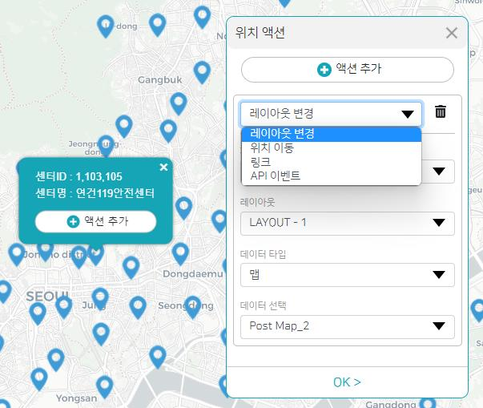

- 맵 편집기에서 웹 맵 추가하고 타이틀을 수정한 뒤 오른쪽 수정 버튼을 클릭하자
- 위에서 설명했던 맵 메뉴 리스트가 나온다.
- 맵 항목을 클릭하고 원하는 배경의 맵을 고르자. 서울시 안전관할 센터이니 맵을 확대하여 서울시가 보이도록 한 후 현재 위치를 저장한다.
- 위치 메뉴에서 맵에 적용할 데이터를 선택하고 나머지 위치들은 눈모양을 비활성화 시켜 준다.
- 다시 맵 메뉴로 돌아가서 현재 위치를 저장해 준다.
- 맵 편집기로 돌아가서 확인해 보면 마지막에 저장한 모습으로 적용된 것을 알 수 있다.
  

- 위치 중에 하나를 선택하면 해당 위치에 대한 상세 정보가 나오고 여기에 액션을 추가할 수 있다. 액션을 추가하고 발행 후 공개된 화면에서 해당 위치를 클릭하게 되면 액션이 실행되게 된다.
  

- 동시에 실행되기 어려운 액션이 여러가지 추가되었을 경우에는 화면 상 가장 위에 적용된 액션이 실행된다.
- 레이아웃 변경: 설정한 페이지에 있는 레이아웃 위치에 설정한 데이터가 적용된다.
- 위치 이동: 선택한 맵의 선택한 위치로 이동한다. 위치 선택 아래 아이콘을 클릭하고 커서를 선택하여 위도와 경도를 지도 위에서 설정할 수도 있다.
- 링크: 설정한 페이지로 이동하거나 인터넷 주소를 입력하여 설정한 인터넷 주소를 띄울 수도 있다. 현재 페이지나 새 창에 링크를 적용시킬 수 있다.
  