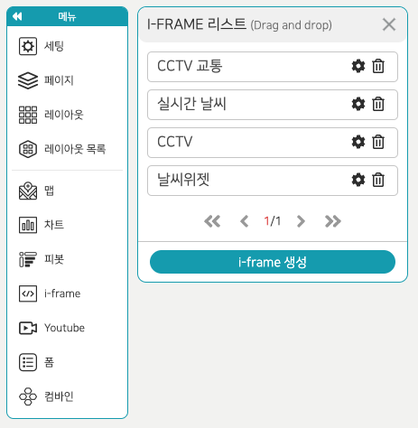

- 현재 i-frame 리스트가 모두 나타나며 레이아웃에 드래그 앤 드롭으로 i-frame을 가져올 수 있다. 설정 아이콘을 누르면 해당 i-frame을 수정할 수 있다.
- 휴지통 아이콘을 클릭하면 해당 i-frame는 삭제되고 레이아웃에 적용된 콘텐츠도 삭제된다.
- i-frame을 이용하여 날씨 위젯, 시간 위젯, cct, 로드뷰, 웹 페이지 등을 레이아웃에 적용시킬 수 있다.
- i-frame 아이콘을 클릭하고 i-frame 리스트에서 i-frame 생성 버튼을 클릭하면 아래와 같은 팝업이 뜬다.
  

- Title 입력 후 Address와 Html 두가지 방식 중에서 선택하여 Contents영역에 입력하고 확인 버튼을 클릭하면 i-frame 리스트에 추가된다.
  